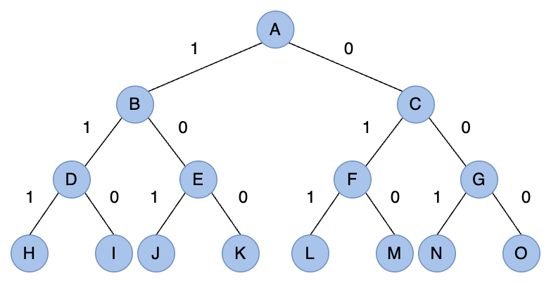

# 回溯法 Backtracking

回溯法（backtracking）是一種在某個集合求其子集或特定排列的特殊解法。它沒有對應的資料結構，但其在求解的過程是固定的。它可以看作是暴力窮舉的一種改進，因為我們這裡所說的集合，通常是指二維陣列、多維陣列或是字串，我們需要從中找到一些符合條件的元素放到結果集中，這是一個試探的過程。
試探，就會有失敗的情況，如何做到只改些許參數，就能夠繼續試探是非常重要的課題。回溯法的雙函式結構是人們在無數的測試中總結出來的。

## 回溯法的格式

backtracking 由兩個部分組成：入口函式和遞迴函式（backtrack）。

入口函式分成幾個部分，首先是對參數的簡單判斷，如果不符合條件，立即回傳空結果集。其次是變數的集中定義區域，結果集與候選集（candidates）就是定義在這裡；通常還會對目前集合進行排序，提升程式的效能；如果要對結果進行去重，去重用的 hash 也會放在這裡。然後是呼叫遞迴函式，最後回傳結果集。

遞迴函式一般命名為 backtrack，它分成兩部分，一個是終止條件，應該放在最前面，用於將 candidate 複製一份加入結果集中。為什麼要複製呢？因為我們的結果集通常是一個二維陣列，而 candidate 在遞迴過程滿足特定條件會增加新元素，因此這不能是一個全新的空 candidate。candidate 都是基於某一個有效的 candidate 進行修改（回溯）的。再來談終止條件，它可能是 candidate 的長度是否達到某個臨界值，或者是否已經到達最後一個元素。遞迴函式的第二個部分是進行 `for` 迴圈，跑迴圈的過程中要收集元素到 candidate，呼叫遞迴函式，因為迴圈過程中的參數是不斷變化的，這樣我們就實現了類似窮舉的效果。在呼叫完遞迴函式後，記得要將一些中間變數還原，變數還原就是回溯的真諦。

當所給問題是從 n 個元素的集合 S 中找出滿足某個性質的子集時，對應的解空間樹稱為子集樹。例如 n 個物品的 0/1 背包問題（如下圖）所對應的解空間樹是一棵子集樹，這類子集樹通常有 $2^n$ 個葉節點，節點總數為 $2(n+1)-1$。遍歷子集樹的演算法需要 $O(2^n)$ 的時間。

<div align="center"> 

<p>0/1 背包問題</p>
</div>

當所給問題是確定滿足某種性質的 n 個元素排列時，對應的解空間樹稱為排列樹。例如旅行推銷員問題（如下圖）的解空間樹是一棵排列樹，這類排列樹通常有 $n!$ 個葉節點。遍歷子集樹的演算法需要 $O(2^n)$ 的時間。

<div align="center">

<p>旅行推銷員問題</p>
</div>

backtracking 的 pseudocode 如下：

```js
// 子集樹
function main(set, 其他參數) {
  if (如果 set 不合法或長度為零，或其他參數明顯有問題) {
    return 簡單結果;
  }
  set.sort(); // 排序提升效率
  let result = [], candidate = [], end = nums.length;

  function backtrack(start, 其他參數) {
    if (start === end) { // 或其他情況
      // 這裡可能還有其他條件
      result.push([...candidate]); // 將候選集複製一份加入結果集
    } else {
      // 注意，如果限定子集數量需要改動一下
      for (let i = start; i < end; i++) {
        // 處理中間變數
        candidate.push(陣列元素);
        backtrack(i + 1, ...);
        candidate.pop(); // 還原 candidate
        // 還原其他中間變數
      }
    }
  }

  backtrack(0, 其他參數);
  return result;
}

// 排列樹
function main(set, 其他參數) {
  if (如果 set 不合法或長度為零，或其他參數明顯有問題) {
    return [];
  }
  // set 不需要排序！
  let result = [], candidate = [], end = nums.length, hash = {};
  // hash 是用來實現排序效果的
  function backtrack(start, 其他參數) {
    if (start === end) { // 或其他情況
      // 這裡可能還有其他條件
      result.push([...candidate]);
      return;
    }
    for (let i = 0; i < end; i++) {
      // 處理中間變數
      if (!hash[i]) {
        hash[i] = true;
        candidate.push(陣列元素);
        backtrack(start + 1, ...);
        candidate.pop(); // 還原 candidate
        hash[i] = false;
        // 還原其他中間變數
      }
    }
  }

  backtrack(0, 其他參數);
  return result;
}
```

## 子集問題的相關題目

子集問題的相關例題包括沒重複元素的子集問題、有重複元素的子集問題、有重複元素的組合總和、背包問題、裝載問題和火柴棒問題等。

### 沒重複元素的子集問題

這是 LeetCode [78. Subsets](https://leetcode.com/problems/subsets/) 的原題，給定一個不包含重複元素的整數陣列 nums，回傳該陣列所有可能的子集（幂集）。注意：結果集不能包含重複的子集。

Example 1:

```text
Input: nums = [1,2,3]
Output: [[],[1],[2],[1,2],[3],[1,3],[2,3],[1,2,3]]
```

Example 2:

```text
Input: nums = [0]
Output: [[],[0]]
```

思路：我們根據上面的 pseudocode 來實現，首先是入口函式的第一部分，怎麼快速排除有問題的參數或特例。如果參數不是陣列或是它的長度為零，我們就直接回穿空陣列。然後我們宣告一個 `result`、`candidate`，排序陣列，然後呼叫遞迴函式。

接下來我們看一下終止條件，因為子集可以為空，也就是說任何情況 `candidate` 都可以放進 `result`。其他就與模板一致了。我們來看一下實作程式碼：

```js
function subsets(nums) {
  if (!Object(nums).length) { // 相當於 !nums || !nums.length
    return [];
  }

  nums.sort((a, b) => a - b);
  const result = [];
  const candidate = [];
  const end = nums.length;

  function backtrack(start) {
    result.push([...candidate]); // 沒有長度限制，直接放進 result

    for (let i = start; i < end; i++) {
      candidate.push(nums[i]); // 試探
      backtrack(i + 1); // 修改參數
      candidate.pop(); // 不管成功與否，退回上一步
    }
  }

  backtrack(0);
  return result;
}
```

整個探索過程如下：

| $i$ | candidate   | result                                                   |
| --- | ----------- | -------------------------------------------------------- |
| `0` | `[1]`       | `[[], [1]]`                                              |
| `1` | `[1, 2]`    | `[[], [1], [1, 2]]`                                      |
| `2` | `[1, 2, 3]` | `[[], [1], [1, 2], [1, 2, 3]]`                           |
| `2` | `[1, 3]`    | `[[], [1], [1, 2], [1, 2, 3], [1, 3]]`                   |
| `1` | `[2]`       | `[[], [1], [1, 2], [1, 2, 3], [1, 3], [2]]`              |
| `2` | `[2, 3]`    | `[[], [1], [1, 2], [1, 2, 3], [1, 3], [2], [2, 3]]`      |
| `2` | `[3]`       | `[[], [1], [1, 2], [1, 2, 3], [1, 3], [2], [2, 3], [3]]` |
