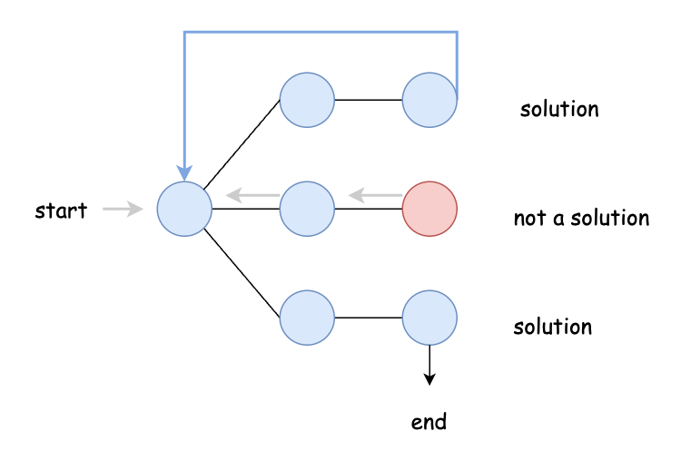
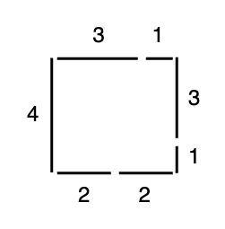
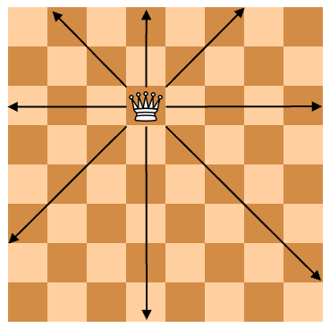
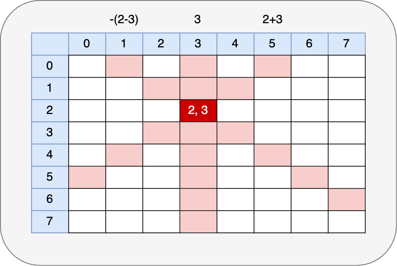

# 回溯法 Backtracking

回溯法（backtracking）是一種在某個集合求其子集或特定排列的特殊解法。它沒有對應的資料結構，但其在求解的過程是固定的。它可以看作是暴力窮舉的一種改進，因為我們這裡所說的集合，通常是指二維陣列、多維陣列或是字串，我們需要從中找到一些符合條件的元素放到結果集中，這是一個試探的過程。
試探，就會有失敗的情況，如何做到只改些許參數，就能夠繼續試探是非常重要的課題。回溯法的雙函式結構是人們在無數的測試中總結出來的。

<div align="center"> 
  
</div>

## 回溯法的格式

backtracking 由兩個部分組成：入口函式和遞迴函式（backtrack）。

入口函式分成幾個部分，首先是對參數的簡單判斷，如果不符合條件，立即回傳空結果集。其次是變數的集中定義區域，結果集與候選集（candidates）就是定義在這裡；通常還會對目前集合進行排序，提升程式的效能；如果要對結果進行去重，去重用的 hash 也會放在這裡。然後是呼叫遞迴函式，最後回傳結果集。

遞迴函式一般命名為 backtrack，它分成兩部分，一個是終止條件，應該放在最前面，用於將 candidate 複製一份加入結果集中。為什麼要複製呢？因為我們的結果集通常是一個二維陣列，而 candidate 在遞迴過程滿足特定條件會增加新元素，因此這不能是一個全新的空 candidate。candidate 都是基於某一個有效的 candidate 進行修改（回溯）的。再來談終止條件，它可能是 candidate 的長度是否達到某個臨界值，或者是否已經到達最後一個元素。遞迴函式的第二個部分是進行 `for` 迴圈，跑迴圈的過程中要收集元素到 candidate，呼叫遞迴函式，因為迴圈過程中的參數是不斷變化的，這樣我們就實現了類似窮舉的效果。在呼叫完遞迴函式後，記得要將一些中間變數還原，變數還原就是回溯的真諦。

當所給問題是從 n 個元素的集合 S 中找出滿足某個性質的子集時，對應的解空間樹稱為子集樹。例如 n 個物品的 0/1 背包問題（如下圖）所對應的解空間樹是一棵子集樹，這類子集樹通常有 $2^n$ 個葉節點，節點總數為 $2(n+1)-1$。遍歷子集樹的演算法需要 $O(2^n)$ 的時間。

<div align="center"> 

<p>0/1 背包問題</p>
</div>

當所給問題是確定滿足某種性質的 n 個元素排列時，對應的解空間樹稱為排列樹。例如旅行推銷員問題（如下圖）的解空間樹是一棵排列樹，這類排列樹通常有 $n!$ 個葉節點。遍歷子集樹的演算法需要 $O(n!)$ 的時間。

<div align="center">

<p>旅行推銷員問題</p>
</div>

backtracking 的 pseudocode 如下：

```js
// 子集樹
function main(set, 其他參數) {
  if (如果 set 不合法或長度為零，或其他參數明顯有問題) {
    return 簡單結果;
  }
  set.sort(); // 排序提升效率
  let result = [], candidate = [], end = nums.length;

  function backtrack(start, 其他參數) {
    if (start === end) { // 或其他情況
      // 這裡可能還有其他條件
      result.push([...candidate]); // 將候選集複製一份加入結果集
    } else {
      // 注意，如果限定子集數量需要改動一下
      for (let i = start; i < end; i++) {
        // 處理中間變數
        candidate.push(陣列元素);
        backtrack(i + 1, ...);
        candidate.pop(); // 還原 candidate
        // 還原其他中間變數
      }
    }
  }

  backtrack(0, 其他參數);
  return result;
}

// 排列樹
function main(set, 其他參數) {
  if (如果 set 不合法或長度為零，或其他參數明顯有問題) {
    return [];
  }
  // set 不需要排序！
  let result = [], candidate = [], end = nums.length, hash = {};
  // hash 是用來實現排序效果的
  function backtrack(start, 其他參數) {
    if (start === end) { // 或其他情況
      // 這裡可能還有其他條件
      result.push([...candidate]);
      return;
    }
    for (let i = 0; i < end; i++) {
      // 處理中間變數
      if (!hash[i]) {
        hash[i] = true;
        candidate.push(陣列元素);
        backtrack(start + 1, ...);
        candidate.pop(); // 還原 candidate
        hash[i] = false;
        // 還原其他中間變數
      }
    }
  }

  backtrack(0, 其他參數);
  return result;
}
```

## 子集問題的相關題目

子集問題的相關例題包括沒重複元素的子集問題、有重複元素的子集問題、有重複元素的組合總和、背包問題、裝載問題和火柴棒問題等。

### 沒重複元素的子集問題

這是 LeetCode [78. Subsets](https://leetcode.com/problems/subsets/) 的原題，給定一個不包含重複元素的整數陣列 `nums`，回傳該陣列所有可能的子集（幂集）。注意：結果集不能包含重複的子集。

Example 1:

```text
Input: nums = [1,2,3]
Output: [[],[1],[2],[1,2],[3],[1,3],[2,3],[1,2,3]]
```

Example 2:

```text
Input: nums = [0]
Output: [[],[0]]
```

思路：我們根據上面的 pseudocode 來實現，首先是入口函式的第一部分，怎麼快速排除有問題的參數或特例。如果參數不是陣列或是它的長度為零，我們就直接回穿空陣列。然後我們宣告一個 `result`、`candidate`，排序陣列，然後呼叫遞迴函式。

接下來我們看一下終止條件，因為子集可以為空，也就是說任何情況 `candidate` 都可以放進 `result`。其他就與模板一致了。我們來看一下實作程式碼：

```js
function subsets(nums) {
  if (!Object(nums).length) { // 相當於 !nums || !nums.length
    return [];
  }

  nums.sort((a, b) => a - b);
  const result = [];
  const candidate = [];
  const end = nums.length;

  function backtrack(start) {
    result.push([...candidate]); // 沒有長度限制，直接放進 result

    for (let i = start; i < end; i++) {
      candidate.push(nums[i]); // 試探
      backtrack(i + 1); // 修改參數
      candidate.pop(); // 不管成功與否，退回上一步
    }
  }

  backtrack(0);
  return result;
}
```

整個探索過程如下：

| $i$ | candidate   | result                                                   |
| --- | ----------- | -------------------------------------------------------- |
| `0` | `[1]`       | `[[], [1]]`                                              |
| `1` | `[1, 2]`    | `[[], [1], [1, 2]]`                                      |
| `2` | `[1, 2, 3]` | `[[], [1], [1, 2], [1, 2, 3]]`                           |
| `2` | `[1, 3]`    | `[[], [1], [1, 2], [1, 2, 3], [1, 3]]`                   |
| `1` | `[2]`       | `[[], [1], [1, 2], [1, 2, 3], [1, 3], [2]]`              |
| `2` | `[2, 3]`    | `[[], [1], [1, 2], [1, 2, 3], [1, 3], [2], [2, 3]]`      |
| `2` | `[3]`       | `[[], [1], [1, 2], [1, 2, 3], [1, 3], [2], [2, 3], [3]]` |

### 有重複元素的子集問題

如果今天給定的陣列存在重複元素呢？我們再來看看 [90. Subsets II](https://leetcode.com/problems/subsets-ii/) 的原題，給定一個可能包含重複元素的整數陣列 `nums`，回傳該陣列所有可能的子集（幂集）。注意：結果集不能包含重複的子集。

Example 1:

```text
Input: nums = [1,2,2]
Output: [[],[1],[1,2],[1,2,2],[2],[2,2]]
```

Example 2:

```text
Input: nums = [0]
Output: [[],[0]]
```

與上一題只有一點差別，但它只是對候選集做出限制，即結果集中不能出現兩個 `[1,2]` 陣列。

我們可以使用 `Hash Table` 來去重，實作程式碼如下：

```js
function subsetsWithDup(nums) {
  nums.sort((a, b) => a - b);
  const result = [];
  const candidate = [];
  const end = nums.length;
  const hash = new Map();

  function backtrack(start) {
    const candidateKey = candidate.toString();
    if (!hash.get(candidateKey)) { // 去除重複
      result.push([...candidate]);
      hash.set(candidateKey, true);
    }
    for (let i = start; i < end; i++) {
      candidate.push(nums[i]);
      backtrack(i + 1);
      candidate.pop();
    }
  }

  backtrack(0);
  return result;
}
```

當然，我們也可以在遞迴函式的 `for` 迴圈中加入判斷去重，有興趣的讀者可以嘗試一下。

### 有重複元素的組合總和

這題是 [39. Combination Sum](https://leetcode.com/problems/combination-sum-ii/) 的原題，給定一個無重複元素的正整數陣列 `candidates` 和一個正整數 `target`，找出 `candidates` 中所有可以使數字之和為 `target` 的組合。`candidates` 中的數字可以無限制重複被選取。

Example 1:

```text
Input: candidates = [2,3,6,7], target = 7
Output: [[2,2,3],[7]]
```

Example 2:

```text
Input: candidates = [2,3,5], target = 8
Output: [[2,2,2,2],[2,3,3],[3,5]]
```

Example 3:

```text
Input: candidates = [2], target = 1
Output: []
```

思路：本題更接近我們的模板，由於元素可以重複使用，我們在遞迴函式的 `for` 迴圈裡就不用改變 `start` 變數。並且我們還要計算放入候選集的元素的總和是否為 `target`，但總不能每次都把候選集加總一次吧，反過來，我們每次將它與新元素相減，只要結果為零，就退出遞迴。實作程式碼如下：

```js
function combinationSum(candidates, target) {
  const result = [];
  const combination = [];
  const end = candidates.length;

  function backtrack(start, target) {
    if (target === 0) { // 等於 0，退出遞迴
      result.push([...combination]);
      return;
    }
    if (target > 0) { // 大於 0，繼續新增元素
      for (let i = start; i < end; i++) {
        combination.push(candidates[i]);
        // 注意這裡 i 沒有加 1，因為可以重複使用相同的數字
        backtrack(i, target - candidates[i]);
        combination.pop();
      }
    }
  }

  backtrack(0, target);
  return result;
}
```

### 無重複元素的組合總和

這題是 [40. Combination Sum II](https://leetcode.com/problems/combination-sum-ii/) 的原題，給定一個元素範圍為 `1~50` 的整數陣列和一個目標數字 `target`，找出陣列中所有可以使數字之和為 `target` 的組合。陣列中的每個數字只能在組合中使用一次。結果集不能包含重複的組合。

Example 1:

```text
Input: candidates = [10,1,2,7,6,1,5], target = 8
Output: [[1,1,6],[1,2,5],[1,7],[2,6]]
```

Example 2:

```text
Input: candidates = [2,5,2,1,2], target = 5
Output: [[1,2,2],[5]]
```

思路與上面很相似，但由於元素只使用一次，我們只要在迴圈中改變 `start` 的值即可。並且題目要求結果集不能包含重複的組合，解決方案一樣是使用 `Hash Table` 去重。實作程式碼如下：

```js
function combinationSum2(candidates, target) {
  candidates.sort((a, b) => a - b);
  const result = [];
  const combination = [];
  const end = candidates.length;
  const hash = {};

  function backtrack(start, target) {
    const combinationKey = combination.toString(); // 將陣列轉為字串當作 key
    if (target === 0 && !hash[combinationKey]) {
      result.push([...combination]);
      hash[combinationKey] = true;
      return;
    }

    if (target > 0) {
      for (let i = start; i < end; i++) {
        combination.push(candidates[i]);
        backtrack(i + 1, target - candidates[i]);
        combination.pop();
      }
    }
  }

  backtrack(0, target);
  return result;
}
```

### 0/1 背包問題

給定 n 個重量為 $w_1, w_2, ..., w_n$，價值為 $v_1, v_2, ..., v_n$ 的物品和一個容量為 capacity 的背包，求如何裝才能在不超過背包承重的情況下，使得背包中物品的總價值最大？

Example:

```text
input: n = 5, [2, 2, 6, 5, 4], [6, 3, 5, 4, 6], capacity = 10
output: 15, [1, 1, 0, 0, 1] // 1 表示選取，0 表示不選取
```

0/1 背包問題的解題思路在於遞迴函式的 `for` 迴圈，其 `end` 變數不再是物品的數量，而是我們決策分支的數量、選還是不選。因此 end = 1（從零開始），然後我們設計一個陣列，來記錄該物品的選擇情況。由於限制條件存在兩個，首先是放進背包的總重量不能超過背包的容量，因此我們需要不斷累計這個變數。其次，當選擇最後一個物品後，我們要看物品的總價值是否比之前的還高。實作程式碼如下：

```js
function knapsack01(n, weights, values, capacity) {
  const allocation = new Array(n).fill(0); // 表示是否選中
  let currValue = 0;
  let currWeight = 0;
  let maxValue = 0;
  let maxWeight = 0;
  let result = [];

  function backtrack(start) {
    if (start === n && currValue > maxValue) {
      maxValue = currValue;
      maxWeight = currWeight;
      result = [...allocation];
      return;
    }

    for (let i = 0; i < 2; i++) {
      if (currWeight + i * weights[start] <= capacity) {
        allocation[start] = i; // 0 為不放進包中，1 為放進包中
        currWeight += i * weights[start];
        currValue += i * values[start];
        backtrack(start + 1);
        currWeight -= i * weights[start];
        currValue -= i * values[start];
      }
    }
  }

  backtrack(0);
  return [maxValue, result];
}
```

### 裝載問題

有 `n` 個集裝箱要裝上兩艘輪船，兩艘輪船的載重分別為 `c1` 和 `c2`。其中每個集裝箱的重量為 `[w0, w1, ..., wi]`，請問是否有一個合理的裝載方案，可將這 `n` 個集裝箱裝上兩艘輪船？

如果有，請給出一個裝載方案。

Example 1:

```text
input: c1 = 50, c2 = 50, goods = [10, 40, 40]
output: [[10, 40], [40]]
```

Example 2:

```text
input: c1 = 50, c2 = 50, goods = [20, 40, 40]
output: [[], []]
```

思路：這題與 0/1 背包問題很相似，只不過上一題是放到一艘船（包）上，這題是放到兩艘船上。在之前的題型中，我們不知道結果集中有多少個子陣列，現在我們明確知道有兩個，我們可以直接生成所有子陣列。然後在遞迴函式的迴圈中，根據子陣列的總和依次判定是否能繼續放東西。實作程式碼如下：

```js
function boatLoad(c1, c2, goods) {
  goods.sort();
  const boats = [[], []];
  const currWeight = [0, 0];
  const maxWeight = [c1, c2];

  function backtrack(start) {
    if (start >= goods.length) {
      return currWeight[0] <= maxWeight[0] && currWeight[1] <= maxWeight[1];
    } else {
      const weight = goods[start];
      for (let i = 0; i < 2; i++) {
        if (currWeight[i] + weight > maxWeight[i]) {
          continue;
        }

        currWeight[i] += weight;
        boats[i].push(weight);

        if (backtrack(start + 1)) {
          return true;
        }

        currWeight[i] -= weight;
        boats[i].pop();
      }
    }
    return false;
  }

  backtrack(0);
  return boats;
}
```

### 火柴棒拼出正方形

給定一個整數陣列 `matchsticks`，裡面的數字代表該個火柴棒的長度，求解是否能將這些火柴棒拼成一個正方形？例如 `[4, 3, 3, 2, 2, 1, 1]` 能拼成如下圖所示的正方形：

<div align="center">

<p>火柴棒拼出正方形問題</p>
</div>

思路：既然是正方形，那肯定有四條邊，因此陣列中的元素不能少於 4 個，且每條邊的長度必須相等，換言之，所有元素的總和必須是 4 的倍數。這樣一來我們就可以輕鬆排除一些不合法的參數。然後進入探索過程，這和裝載問題差不多，不同的是我們需要 4 個子陣列。實作程式碼如下：

```js
function makesquare(matchsticks) {
  if (matchsticks.length < 4) {
    // 如果火柴棒數量小於 4，則無法構成正方形
    return false;
  }

  const sides = [[], [], [], []]; // sides 是用來觀察每個邊的火柴棒的，可以不要有
  const total = matchsticks.reduce((acc, curr) => acc + curr, 0);

  if (total % 4) {
    // 不能被 4 整除
    return false;
  }

  matchsticks.sort((a, b) => b - a); // 由大到小排序
  const maxSideLength = total / 4;
  const currSide = [0, 0, 0, 0];
  const end = matchsticks.length;

  function backtrack(start) {
    if (start >= end) {
      return (
        currSide[0] === maxSideLength &&
        currSide[1] === maxSideLength &&
        currSide[2] === maxSideLength &&
        currSide[3] === maxSideLength
      );
    } else {
      for (let i = 0; i < 4; i++) {
        if (currSide[i] + matchsticks[start] > maxSideLength) {
          continue;
        }

        sides[i].push(matchsticks[start]); // 這個可以不要
        currSide[i] += matchsticks[start];

        if (backtrack(start + 1)) {
          return true;
        }

        sides[i].pop(); // 這個可以不要
        currSide[i] -= matchsticks[start];
      }
    }
    return false;
  }

  const result = backtrack(0);
  console.log(JSON.stringify(sides), result);
  return result;
}
```

## 排列問題的相關題目

遍歷整個排列樹需要 $O(n!)$ 的時間，因此在遞回函式中，`for` 迴圈不是從 `start` 開始，而是每次都從 `0` 或 `1` 開始，然後通過 `hash` 看某個索引是否被使用過，實現排列效果。

### 全排列問題

這題是 LeetCode [46. Permutations](https://leetcode.com/problems/permutations/) 的原題，給定一個沒有重複數字的整數陣列 `nums`，回傳所有可能的排列。

```text
Input: nums = [1,2,3]
Output: [[1,2,3],[1,3,2],[2,1,3],[2,3,1],[3,1,2],[3,2,1]]
```

直接套用模板，我們需要遞迴函式，透過 `hash` 對某一索引的控制，來讓對應元素加入某一個解，從而實現全排列。實作程式碼如下：

```js
function permute(nums) {
  const result = [];
  const candidate = [];
  const end = nums.length;
  const used = {};

  function backtrack(start) {
    if (start === end) {
      result.push([...candidate]);
    } else {
      for (let i = 0; i < end; i++) {
        if (!used[i]) {
          candidate.push(nums[i]);
          used[i] = true;
          backtrack(start + 1);
          candidate.pop();
          used[i] = false;
        }
      }
    }
  }

  backtrack(0);
  return result;
}
```

### 質數圓環

輸入正整數 `n`，把整數 `1~n` 組成一個圓環，使得相鄰兩個數之和都是質數，輸出時從整數 `1` 開始逆時針輸出。同一個圓環應該只輸出一次。`0 < n <= 16`，如圖所示：

<div align="center">

<p>Prime Ring Problem</p>
</div>

Example 1:

```text
input: n = 6
output: 2
explanation:
  1 4 3 2 5 6
  1 6 5 2 3 4
```

Example 2:

```text
input: n = 8
output: 4
explanation:
  1 2 3 8 5 6 7 4
  1 2 5 8 3 4 7 6
  1 4 7 6 5 8 3 2
  1 6 7 4 3 8 5 2
```

思路：首先我們要搞定質數如何判定的問題。其次是考慮環的意思，即最後一個數與第一個數也會相鄰，他們相加也要是質數。

實作程式碼如下：

```js
const primes = {
  2: true,
  3: true,
};

function isPrime(k) {
  const n = Math.sqrt(k);

  if (primes[k] !== undefined) {
    return primes[k];
  }

  if (k % 2 === 0) {
    return (primes[k] = false);
  }

  for (let i = 3; i <= n; i++) {
    if (k % i === 0) {
      return (primes[k] = false);
    }
  }

  return (primes[k] = true);
}

function getPrimeCircle(n) {
  const array = [1];
  const used = {};
  let count = 0;

  function backtrack(start) {
    if (start === n) {
      if (isPrime(array[0] + array[n - 1])) {
        count++;
      }
    } else {
      for (let i = 2; i <= n; i++) {
        // 條件為沒有使用過且前一個數值與下一個 i+1 的和為質數
        if (!used[i]) {
          used[i] = true;
          if (isPrime(array[start - 1] + i)) {
            array[start] = i;
            backtrack(start + 1);
          }
          used[i] = false;
        }
      }
    }
  }

  backtrack(1);
  return count;
}
```

### Scheduling

工廠有 `n` 份工作，每份工作都分成兩個任務，任務 A 只能在一號機中處理，任務 B 只能在二號機處理，並且每份工作只有完成任務 A 之後才能處理任務 B。每份工作的 A、B 任務在兩個機器上的處理時間都不同。對於一個確定的工作排程，假設 `Fji` 是工作 `i` 在機器 `j` 上完成處理的時間，則所有工作在二號機上完成處理的時間總和稱為該工作排程的完成時間和。

現在希望你能找出一個最佳排程，使得完成時間和最小。

Example:

```text
input: 
n = 3 // 參數 1 為工作數
timeA = [2,3,2] // 參數 2 為工作 i 在一號機上完成處理的時間
timeB = [1,1,3] // 參數 3 為工作 i 在二號機上完成處理的時間

output:
18 // 最小完成時間和
[0, 2, 1] // 排程順序
```

本題的難點是理解完成時間這個概念。

假設我們有兩份工作，它們總共包含 4 個任務，A1、A2、B1、B2。一號機上的任務不需要等待，A1 完成後就能立即開始處理 A2。二號機需要等到一號機加工出一個任務後才能開始處理，也就是 B1 的開工時間是 A1 的結束時間，它的完成時間是 A1 + B1。A2 的開工時間是 A1 完成時間，它的結束時間就是 A1 + A2，那麼 B2 什麼時候開工呢？它需要等到 A2 與 B1 都完工後才能開始，也就是兩者的最大值，它的完成時間是 `Math.max(A1 + A2, B1) + B2`。

範例中有 3 個作業和 2 個機器，每個機器處理任務的時間如下表所示，如果排程順序分別為任務 1、任務 2、任務 3，根據上面公式我們能算出二號機的完成時間。

| 任務  | 一號機 | 二號機 | 一號機完成時間 | 二號機完成時間 |
| ----- | ------ | ------ | -------------- | -------------- |
| 工作1 | 2      | 1      | 2              | 3              |
| 工作2 | 3      | 1      | 5              | 6              |
| 工作3 | 2      | 3      | 7              | 10             |

那麼完成時間和就是 3 + 6 + 10 = 19。

實作程式碼如下：

```js
function schedule(n, timeA, timeB) {
  let bestTime = Infinity;
  const bestFlow = [];
  const candidate = [];
  const used = {};

  function backtrack(start) {
    if (start === n) {
      let prevA = 0;
      let prevB = 0;
      let time = 0;
      for (let i = 0; i < n; i++) {
        const index = candidate[i];
        const taskA = prevA + timeA[index];
        const taskB = Math.max(taskA, prevB) + timeB[index];
        prevA = taskA;
        prevB = taskB;
        time += taskB;
      }

      if (time < bestTime) {
        bestTime = time;
        bestFlow.length = 0;
        bestFlow.push(...candidate);
      }
    } else {
      for (let i = 0; i < n; i++) {
        if (!used[i]) {
          candidate.push(i);
          used[i] = true;
          backtrack(start + 1);
          used[i] = false;
          candidate.pop();
        }
      }
    }
  }

  backtrack(0);
  console.log('最小完成時間:', bestTime);
  console.log('最佳工作排程:', bestFlow.join(' -> '));
  return [bestTime, bestFlow];
}
```

### 八皇后問題

八皇后問題（Eight Queens Puzzle）是在 1848 年由西洋棋棋手 Max Bezzel 提出的。問題是：在 8x8 的棋盤上，放置 8 個皇后，使得任意兩個皇后都不能在同一行、同一列或同一斜線上（即無法互吃），一共有幾種不同的方法？

<div align="center">

<p>Eight Queens Puzzle</p>
</div>

思路：首先我們要表示皇后的座標，直接的做法是用一個二維陣列來模擬棋盤，放皇后的格子為 1，沒有放的格子為 0。但是從條件可以知道，每一列只能放一個皇后，因此我們可以用一維陣列來表示，`path[col] = row`，表示這個位於 `row` 列的皇后，其所在的行爲 `col`。

接著我們要判定兩個格子是否在同一條線上，由於每個皇后所在的列都不一樣，因此不需要判斷列所在的線，我們只需要判斷：縱向線、對角線（左上到右下）、反對角線。接下來需要判斷這些線投射到每一列時的列號。縱向線不用多說，直接取其 `y` 座標，對角線是 `x` 座標 - `y` 座標的相反數，反對角線是 `x` 座標 + `y` 座標。如下圖所示：

<div align="center">

<p>Eight Queens Puzzle 2</p>
</div>

實作程式碼如下：

```js
function findQueen() {
  const result = [];
  const path = [];
  const columns = {};
  const mainDiagonal = {};
  const backDiagonal = {};

  function isSafe(row, col) {
    return !columns[col] && !mainDiagonal[-(row - col)] && !backDiagonal[row + col];
  }

  function backtrack(row) {
    if (row === 8) {
      result.push([...path]);
    } else {
      for (let col = 0; col < 8; col++) {
        if (isSafe(row, col)) {
          // 目前位置可以放置
          path[row] = col; // 紀錄放置的位置
          columns[col] = true; // 目前皇后所在位置
          mainDiagonal[-(row - col)] = true; // 主對角線在第一列行號
          backDiagonal[row + col] = true; // 反對角線第一列的行號
          backtrack(row + 1);
          // 回溯
          path[row] = undefined;
          columns[col] = false;
          mainDiagonal[-(row - col)] = false;
          backDiagonal[row + col] = false;
        }
      }
    }
  }

  backtrack(0);
  return result.length;
}
```

## 參考資料

- [《JavaScript 算法：基本原理與代碼實現》](https://www.tenlong.com.tw/products/9787115596154?list_name=r-zh_cn)
- [演算法筆記 - Backtracking](https://web.ntnu.edu.tw/~algo/Backtracking.html)
- [裝載問題 - by 司徒正美](https://zhuanlan.zhihu.com/p/84807112)
- [Eight queens puzzle](https://en.wikipedia.org/wiki/Eight_queens_puzzle)
