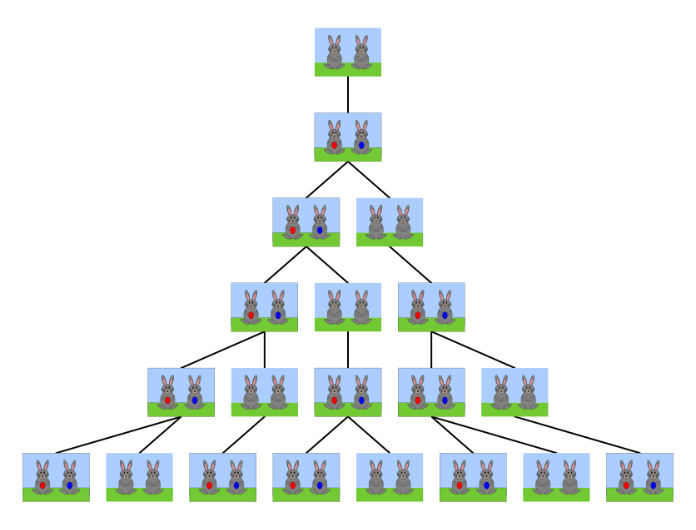
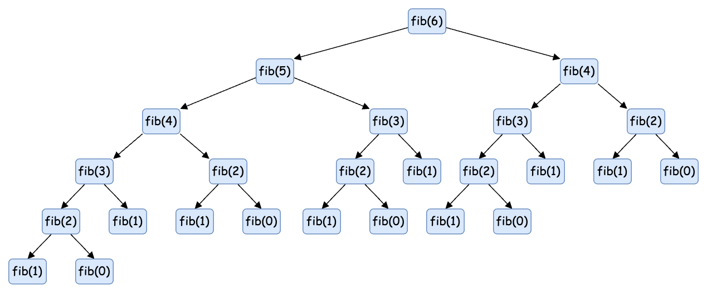
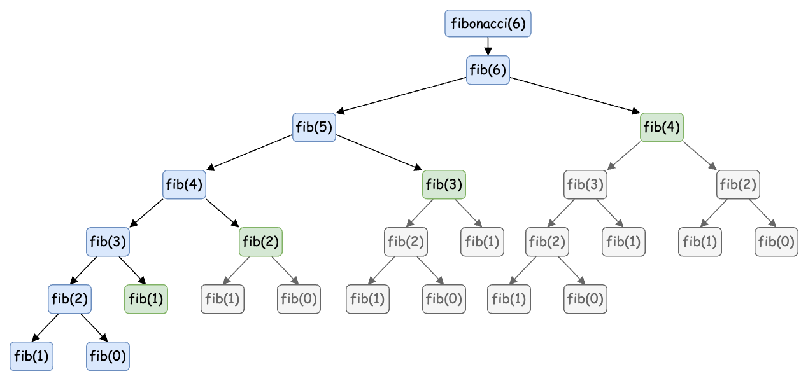
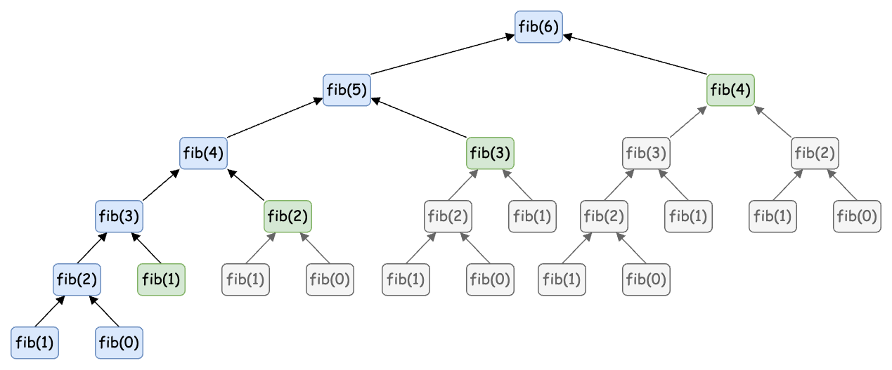
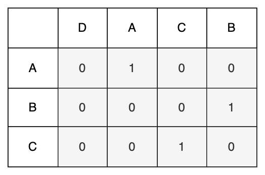
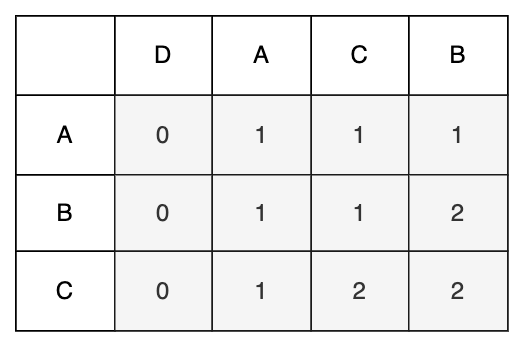
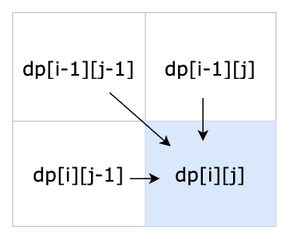
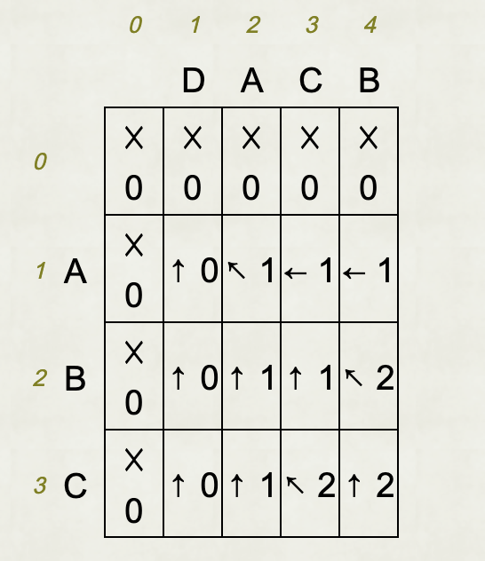

# 動態規劃 Dynamic Programming

動態規劃（Dynamic Programming, DP）一般在面試時多作為壓軸題出現，它在現實中的用途極廣，並且有著不錯的效能表現。動態規劃的題目一般有以下特點：

- 題目要求最佳解，簡單來說出現包含“最”的字眼，比如最長、最少、最大等，這叫最佳化原則。而問題的最佳解可以從子問題的最佳解獲得，這叫**最佳子結構**。
- 問題可以拆分成多個子問題，前一個子問題的解，能夠為後面的子問題提供幫助。為了提升效能，我們通常會用**填表法**（一維或二維陣列）保存這些局部的解。這樣的特性稱作**重疊子問題**。
- 問題分成多個階段，某階段的狀態一但確定，就不受之後階段的決策影響。換言之，我們可以用這樣的方式最佳化填表法，將二維陣列壓縮成一維陣列。這個特性稱作**無後效性**。

此外，原問題還會給出當某個值為 0 或者 1 時的解，我們可以用利用它們推斷填表格時用的公式，這個公式被稱為**狀態轉移方程**。

## 費氏數列 Fibonacci Sequence

費氏數列（費波那契數列），義大利人 Leonardo Fibonacci 他在描述兔子生長的數目時用上了這數列。假設一對剛誕生的兔子要等一個月才會到成熟期，而一對成熟的兔子每個月可以生一對小兔子，那麼從一對新生兔子開始，且兔子永不死去，求解 n 個月後兔子的總數。如下圖所示：

<div align="center">
  
</div>

| 月份             | 1   | 2   | 3   | 4   | 5   | 6   | 7   | 8   | 9   | ... |
| ---------------- | --- | --- | --- | --- | --- | --- | --- | --- | --- | --- |
| 兔子總數(對)     | 1   | 1   | 2   | 3   | 5   | 8   | 13  | 21  | 34  | ... |
| 可生育兔子數(對) | 0   | 1   | 1   | 2   | 3   | 5   | 8   | 13  | 21  | ... |

經過觀察可以發現，除了最初兩項等於 1 以外，每一項都等於前兩項之和。

接著我們用費式數列當作例子來幫助我們理解上面提到比較晦澀的概念以及體驗一下動態規劃的高效。許多題目都可以用多種不同思路去解決，我們會從最簡單的暴力法開始，慢慢過渡到動態規劃的解法。

### 暴力法

直接透過遞迴的方式求解，實作如下：

```js
function fib(n) {
  if (n === 1 || n === 2) return 1;
  return fib(n - 1) + fib(n - 2);
}
console.log(fib(12)); // 144
```

這種方法的效能非常差，我們將遞迴呼叫用樹狀圖表示出來，如下圖所示：

<div align="center">
  
</div>

此時我們會發現裡面存在很多函式被多次呼叫，例如：`fib(3)` 被呼叫了 3 次，也就是說同一個子問題 `fib(i)` 會被處理很多次。這些遞迴函式的執行次數為二元樹的節點數。顯然二元樹的總節點數為指數級別，所以子問題的個數為 $O(2^n)$，當你的 n = 50 時，瀏覽器可能就會卡住不能動了。

此時就需要使用動態規劃來解決這個問題了，我們可以用兩種方法來改進剛才的暴力法：

- Top-down
- Bottom-up

### Top-down Dynamic Programming (Memoization)

其實就是多了一個 cache，然後從上而下遞迴從大問題開始解決，遇到重複子問題時，就從快取中取出答案，避免重複計算。這種方法稱為**記憶化**（Memoization）。
通常我們會用一個 hash 當作快取（cache），我們可以把 cache 放入 `fib` 函式中。當參數傳入時，先檢查 cache 中是否有答案，沒有才進行計算，這樣整個數列的 `fib(6)`、`fib(5)`、`fib(4)`、`fib(3)`、`fib(2)`、`fib(1)` 都只會計算一次，效能也提升到了 $O(n)$。如下圖：

<div align="center">
  
</div>

我們可以從圖中觀察 Memoization 的過程是從 `fib(6)` 一路呼叫到 `fib(1)` 與 `fib(2)` 時，`fib(3)` 就會有答案，然後向上折回。在遞迴呼叫的 tree 中，綠色的節點被重複執行但是因為已經計算過了，所以會直接從 cache 中取出答案，不會再重複計算。實作程式碼如下：

```js
function fibonacci(n) {
  const cache = { 0: 0, 1: 1, 2: 1 };

  function fib(n) {
    if (cache[n] !== undefined) return cache[n];
    cache[n] = fib(n - 1) + fib(n - 2);
    return cache[n];
  }

  return fib(n);
}
console.log(fibonacci(100)); // 354224848179262000000
```

### Bottom-up Dynamic Programming

透過記憶化的方式，我們知道了快取的重要性，其實這些參數是從 1 到 n 遞增的，因此我們可以直接用一個陣列來保存結果。然後在迴圈中將前面兩項的值相加就是目前項的解，然後又把這個解放入陣列中，又可以求出更後面的解。這個陣列就是我們一開始說到的表（table）了。如下圖所示：

<div align="center">
  
</div>

- 初始化 `fib(0)`、`fib(1)`、`fib(2)` 的值（也可以只初始化 `fib(0)`、`fib(1)`）
- 然後計算 `fib(1)` 與 `fib(2)` 的值得到 `fib(3)`
- 依此類推，直到 `fib(n)` 的值

實作程式碼如下：

```js
function fib(n) {
  const table = [0, 1, 1]; // dp table
  for (let i = 3; i <= n; i++) {
    table[i] = table[i - 1] + table[i - 2]; // fill the table
  }
  return table[n];
}
```

現在讓我們來總結一下 DP 的套路。首先，我們有一些起始資料，可以直接放入表中，例如費氏數列一開始是 `[0, 1]`，接著找到變數，在這裡是 `n`，並且我們知道從 `n = 3` 開始 `fib(n)` 值會是 `fib(n - 1)` 加上 `fib(n-2)`。這個變化可以透過方法描述出來，這個方法就是狀態轉換方程：

$$
f(n) = \begin{cases}
  1 & \text{if } n = 1 \text{ or } 2\\
  f(n - 1) + f(n - 2) & \text{if } n \geq 3
\end{cases}
$$

我們需要仔細根據 0、1、2 這幾項的初始解來找規律。又由於動態規劃可以透過無後效性來最佳化效能，回到這題我們可以發現，其實我們只需要保存前兩項的值就可以了，到了第 4 項時，第 1 項的值已經沒用了，所以我們可以用兩個變數來保存前兩項的值，這樣空間複雜度就從 $O(n)$ 降到 $O(1)$ 了。實作程式碼如下：

```js
function fib2(n) {
  let a = 0;
  let b = 1;
  if (n === 0) return a;
  for (let i = 2; i <= n; i++) {
    const c = a + b;
    a = b;
    b = c;
  }
  return b;
}
```

## 找零錢 Coin Change

這題的原題為 [322. Coin Change](https://leetcode.com/problems/coin-change/)，題目如下：

給你一個整數陣列 `coins` 表示不同面額的硬幣，另給一個整數 `amount` 表示總金額，問你最少需要多少個硬幣來組成這個金額，如果無法組成，則回傳 -1。

例如有三種硬幣，幣值分別是 1、2、5，總金額為 11，那麼最少需要 3 枚硬幣來組成，即 11 = 5 + 5 + 1。

```text
input: coins = [1, 2, 5], amount = 11
output: 3
explanation: 11 = 5 + 5 + 1
```

這題很容易讓人直接使用 greedy 來解，優先使用最大面額去除掉總金額，得到個數後再用其他面額去處理餘數。但這樣做很容易得到無解的錯誤結果。我們還是遵循動態規劃的要點，先找出變數，題目中的總金額是不明確的，它需要從外部去傳入，另外硬幣種類可能是 3 也可能是 6，因此它是一個變數。然後我們根據一些邊界值 (0, 1, -1) 來尋找規律，當總金額為 0 時，那麼硬幣數肯定是 0。如果不為 0，那麼至少會有一枚硬幣，它可能是 1、2 或 5 的其中一個，並且它接近總額但不能大於總額，於是問題變成當總額為 `amount - coin[i]` 時，最少需要多少枚硬幣，這就是硬幣數最少的重疊子問題。

規律公式如下：

$$
f(n) = \begin{cases}
  0 & \text{if } n = 0 \\
  1 + \min \{ f(n - c_i) \mid i \in [1, k] \} & \text{otherwise}
\end{cases}
$$
> k 為硬幣種類數量，$c_i$ 為第 i 種硬幣的面額。

第二個式子不太好理解，它其實是一個迴圈，在迴圈中不斷呼叫自己找出最小值。不過這裡的 min 只有一個參數，我們可以在程式中新增另一個參數預設是 `Infinity`，具體程式碼如下：

```js
function coinChange(coins, amount) {
  if (amount === 0) return 0;

  let ans = Infinity;
  for (const coin of coins) {
    console.log('TEST');
    if (coin <= amount) {
      const count = coinChange(coins, amount - coin);
      if (count !== -1) {
        ans = Math.min(ans, count + 1);
      }
    }
  }

  return ans === Infinity ? -1 : ans;
}
console.log(coinChange([1, 2, 5], 11)); // 3
```

在上面的實作中，實際去跑一下 `coinChange([1, 2, 5], 11)` 會發現 `console.log('TEST')` 被打了 927 次才得出 3 這個結果。

因此我們按照之前的方式，使用一個 cache 來改善效能，實作如下：

```js
function coinChange(coins, amount) {
  const cache = new Array(amount + 1).fill(Infinity);
  cache[0] = 0;

  function _coinChange(coins, amount) {
    if (cache[amount] !== Infinity) return cache[amount];

    let ans = Infinity;
    for (const coin of coins) {
      if (amount >= coin) {
        console.log('TEST');
        const count = _coinChange(coins, amount - coin);
        if (count !== -1) {
          ans = Math.min(ans, count + 1);
        }
      }
    }

    cache[amount] = ans === Infinity ? -1 : ans;
    return cache[amount];
  }

  return _coinChange(coins, amount);
}
```

這次你會發現 `console.log('TEST')` 已經減少到 28 次了。

最後我們再來改成 bottom-up 的方式。我們需要跑迴圈去填表，那麼 `i` 要從哪到哪呢？我們已經知道 0 的情況，現在要求 `amount` 的解，因此 `i` 從 1 到 `amount`。也就是：

```js
function coinChange2(coins, amount) {
  // 因為是從 0 ~ n 所以 table 長度為 n + 1，並且初始化為 Infinity
  const table = new Array(amount + 1).fill(Infinity);
  table[0] = 0;

  for (let i = 1; i <= amount; i++) {
    for (const coin of coins) {
      if (i < coin) continue;
      // ...
    }
  }
  // ...
}
```

然後在迴圈裡面，我們利用 table 來取值，替代掉剛才的傳參跑遞迴的方式，剛才的參數是 `amount - coin`，現在是 `table[amount - coin]`。

接下來我們要處理 `ans = Math.min(ans, count + 1)`，這裡的 `count` 其實就是 `table[amount - coin]`。那 `ans` 呢？它代表最終解，當 `i = amount` 時，`ans = table[i]`。因此我們可以把 `ans` 改成 `table[i]`，所以可以寫成這樣：

```js
function coinChange2(coins, amount) {
  const table = new Array(amount + 1).fill(Infinity);
  table[0] = 0;

  for (let i = 1; i <= amount; i++) {
    for (const coin of coins) {
      if (i < coin) continue;
      table[i] = Math.min(table[i], table[i - coin] + 1);
    }
  }
  // ...
}
```

最後是處理無解的情況，如果 `table[amount]` 還是 `Infinity`，那就代表無解，回傳 -1。最後的程式碼如下：

```js
function coinChange2(coins, amount) {
  // 通常 table 也會被取成 dp
  const table = new Array(amount + 1).fill(Infinity);
  table[0] = 0;

  for (let i = 1; i <= amount; i++) {
    for (const coin of coins) {
      if (i < coin) continue;
      table[i] = Math.min(table[i], table[i - coin] + 1);
    }
  }

  return table[amount] === Infinity ? -1 : table[amount];
}
```

## 最長不下降子序列 Longest Non-decreasing Subsequence

有一個由 n (`n <= 1 <= 200`) 個整數組成的數列，標記為：$a_1, a_2, ..., a_n$。請你從中找出一個**最長的不下降子序列**，也就是說找出一個最長的整數序列 $i_1, i_2, ..., i_k$，使得對於任意的 j (`1 <= j <= k - 1`)，都滿足 $i_j < i_{j + 1}$ 且 $a_{i_j} \leq a_{i_{j + 1}}$。

例如：`[1, 2, 3, -9, 3, 9, 0, 11]`，它的最長不下降子序列為 `[1, 2, 3, 3, 9, 11]`。

思路：我們建立一個 table，長度等於原數列長度，`table[i]` 表示以 `array[i]` 為結束的非下降子序列的長度。一開始它們的值都是 1，可以參考下表。我們分別用 `[4]`、`[1,3]`、`[3,1]` 和 `[1,2,3]` 這些總長為 1、2、3 的陣列來推論規律。

| array     | table initStatus | table lastStatus |
| --------- | ---------------- | ---------------- |
| `[4]`     | `[1]`            | `[1]`            |
| `[1,3]`   | `[1,1]` j=0, i=1 | `[1,2]`          |
| `[3,1]`   | `[1,1]` j=0, i=1 | `[1,1]`          |
| `[1,2,3]` | `[1,1,1]`        | `[1,2,3]`        |

如果 `array[i] >= array[j](j < i)`，那麼 `table[i] = Math.max(table[i], table[j] + 1)`。

因此 table 中的元素隨著索引的遞增，其值即便不加 1 也不會變小，就像一個台階一樣不斷往上累加 1。

又由於 `table[i]` 的值是透過 `0 ~ i` 的子陣列推導出來的，因此我們可以用一個雙層迴圈來填表，`i` 跑整個陣列，`j` 跑 `0 ~ i` 的子陣列。實作程式碼如下：

```js
function longestNonDecreasingSequence(array) {
  const dp = new Array(array.length).fill(1);
  let max = 1;
  let maxIndex = 0;

  for (let i = 1; i < array.length; i++) {
    for (let j = 0; j < i; j++) {
      const current = array[i];
      const previous = array[j];

      if (current >= previous && dp[i] < dp[j] + 1) {
        dp[i] = dp[j] + 1;

        if (max < dp[i]) {
          max = dp[i];
          maxIndex = i;
        }
      }
    }
  }

  const result = [array[maxIndex]];
  let m = max;
  let i = maxIndex - 1; // 從最後一個往前找
  while (m > 1) {
    // 相鄰的 dp[i] 都是等差或是相差 1
    if (dp[i] === m - 1 && array[i] <= array[maxIndex]) {
      result.unshift(array[i]);
      maxIndex = i;
      m--;
    }
    i--;
  }

  return result;
}
```

這個問題其實就是最長遞增子序列（Longest Increasing Subsequence, LIS）的變形，多了一個等於的條件。有興趣的讀者可以參考 [300. Longest Increasing Subsequence](https://leetcode.com/problems/longest-increasing-subsequence/)。

## 最長共同子序列 Longest Common Subsequence

給你兩個字串，求解這兩個字串的最長共同子序列（Longest Common Subsequence, LCS）的長度。例如：`abcde` 與 `ace` 的 LCS 為 `ace`，長度為 3。

LCS 是一個很實用的問題，它可以是不連續的。它可以用在描述兩段文字之間的“相似度”，也就是雷同程度，進而去判斷是否為抄襲。對一段文字進行修改時，計算修改前後文字的 LCS，將除此子序列外的部分提取出來，用這個方式來判斷修改的部分，往往十分準確。

思路：這題比上一題的還難，上一題只有一個字串（或陣列），這題有兩個字串，因此填表用的 table 會變成二維陣列，也就是矩陣。矩陣的橫列表示第一個字串，縱行表示第二個字串，如果某一列與某一行相交的字元相同，我們就填 1，否則就填 0。但這樣點完之後還需要再清點一次，如圖所示：

<div align="center">
  
</div>

我們繼續來改進一下，如果格子對應的字元相同，那麼它的值就等於左上角格子的值加 1，如果不存在則預設為 0；如果不相同，那麼它的值就等於左邊格子與上面格子取最大值。最後右下角的值就是 LCS 的長度。如下圖所示：

<div align="center">
  
</div>

根據上面的規則，我們可以寫出狀態轉移方程：

$$
f(i, j) = \begin{cases}
  0 & !s_1[i] \text{ || } !s_2[j] \\
  f(i - 1, j - 1) + 1 &  s_1[i] == s_2[j] \\
  \max \{ f(i - 1, j), f(i, j - 1) \} & s_1[i] \text{ != } s_2[j]
\end{cases}
$$

整個轉移的過程如下：

<div align="center">
  
</div>

為了避免左上格子不存在的問題，我們有兩種解法：一是將 str1、str2 字串轉換成陣列，然後在陣列前面加上一個空字串，並規定空字串與其他字串比較時，結果永遠是 0；二是在矩陣左側和上方額外新增 1 行與列，並將它們的值都設為 0，笑果如下圖所示：

<div align="center">
  
</div>

我們用第二種方式來實作，程式碼如下：

```js
function LCS(str1, str2) {
  const m = str1.length;
  const n = str2.length;

  const dp = [new Array(n + 1).fill(0)];

  for (let i = 1; i <= m; i++) {
    dp[i] = [0];
    for (let j = 1; j <= n; j++) {
      if (str1[i - 1] === str2[j - 1]) {
        dp[i][j] = dp[i - 1][j - 1] + 1;
      } else {
        dp[i][j] = Math.max(dp[i][j - 1], dp[i - 1][j]);
      }
    }
  }

  return dp[m][n];
}
```

如果我們要實際求出 LCS 字串，可以從右下角開始往左上角找回去，遇到相同的字元就加入結果中，遇到不同的字元就往左或往上找，直到找到左上角為止。我們可以使用一個遞迴函式來實現，程式碼如下：

```js
function printLCS(dp, str1, str2, i, j) {
  if (i === 0 || j === 0) {
    return '';
  }

  if (str1[i - 1] === str2[j - 1]) {
    return printLCS(dp, str1, str2, i - 1, j - 1) + str1[i - 1];
  }

  if (dp[i][j - 1] > dp[i - 1][j]) {
    return printLCS(dp, str1, str2, i, j - 1);
  }

  return printLCS(dp, str1, str2, i - 1, j);
}

function LCS(str1, str2) {
  // 略
  const lcs = printLCS(dp, str1, str2, m, n);
  console.log(lcs);
  return dp[m][n];
}

LCS('DACB', 'ABC'); // AC
```

## 爬樓梯 Climbing Stairs

這題的原題為 [70. Climbing Stairs](https://leetcode.com/problems/climbing-stairs/)，題目如下：假設你正在爬樓梯。需要 n 階你才能到達樓頂，每次你可以爬 1 或 2 個台階。你有多少種不同的方法可以爬到樓頂呢？（`1 <= n <= 45`）

例如：

給定 n = 2，回傳 2，因為有兩種方法可以爬到樓頂。

- 1 階 + 1 階
- 2 階

給定 n = 3，回傳 3，因為有三種方法可以爬到樓頂。

- 1 階 + 1 階 + 1 階
- 1 階 + 2 階
- 2 階 + 1 階

思路：我們可以先從範例觀察一下，`dp[1] = 1, dp[2] = 2, dp[3] = dp[1] + dp[2] = 3`。接下來確認一下 `dp[4]` 的值，有 `[1,1,1,1], [1,1,2], [1,2,1], [2,1,1], [2,2]` 這 5 種組合，然後我們發現 `dp[4] = dp[3] + dp[2]`。這樣我們就可以推論出狀態轉移方程：

$$
f(n) = \begin{cases}
  1 & \text{if } n = 1 \\
  2 & \text{if } n = 2 \\
  f(n - 1) + f(n - 2) & \text{if } n \geq 3
\end{cases}
$$

知道規律後就可以利用動態規劃來解題了，實作程式碼如下：

```js
function climbStairs(n) {
  const dp = [0, 1, 2];
  for (let i = 3; i <= n; i++) {
    dp[i] = dp[i - 1] + dp[i - 2];
  }
  return dp[n];
}
```

## 背包問題 0/1 Knapsack Problem

一個背包有一定的耐重量 `W`，有一系列物品 `1, 2, ..., n`，每個物品都有自己的重量 `w[i]` 與價值 `v[i]`，在不超過耐重量的情況下，我們如何選擇物品使得總價值最高？

「0/1」的意思是每件物品只能選擇 0 個或 1 個。也就是要嘛就是放進背包，要嘛就是不放進背包。

其實這類問題和之前的 coin change 有相似之處。我們使用一個二維的 dp 陣列來記錄，其中 `dp[i][j]` 表示耐重為 `j` 時，前 `i` 個物品的最大價值。當 `i = 0` 時，也就是放入第一個物品時，則：`dp[0] = j > w[0] ? v[j] : 0`。當 `j = 0` 時，`dp[i] = 0`。當 `i > 0` 且 `j > 0` 時，我們有兩種選擇：

1. 不放入第 `i` 個物品，則 `dp[i][j] = dp[i - 1][j]`。
2. 放入第 `i` 個物品，則 `dp[i][j] = dp[i - 1][j - w[i]] + v[i]`，需要 `j >= w[i]`。

綜上，我們可以得到：`dp[i][j] = max(dp[i - 1][j], dp[i - 1][j - w[i]] + v[i])`。

實作程式碼如下：

```js
function knapsack01(w, v, W) {
  if (w.length === 0 || v.length === 0 || W === 0) {
    return 0;
  }

  const n = w.length;
  // 建立一個 n * (W + 1) 的矩陣
  const dp = new Array(n).fill(0).map(() => new Array(W + 1).fill(0));

  // 初始化第 0 列
  for (let i = 0; i <= W; i++) {
    dp[0][i] = i >= w[0] ? v[0] : 0;
  }

  // 初始化第 0 行
  for (let i = 0; i < n; i++) {
    dp[i][0] = 0;
  }

  for (let i = 1; i < n; i++) {
    for (let j = 1; j <= W; j++) {
      if (j < w[i]) {
        dp[i][j] = dp[i - 1][j];
      } else {
        dp[i][j] = Math.max(
          dp[i - 1][j],
          dp[i - 1][j - w[i]] + v[i]
        );
      }
    }
  }

  return dp[n - 1][W];
}
```

## 總結

動態規劃不像回溯法那樣有特定的套路，雖然我們可以針對可變的部分抽取出狀態，但這些狀態需要結合填表法才能找到真正的意義。此外關於狀態轉移式，有的題目已經給出前幾步的結果，你可以輕鬆地推論出來；有的題目就比較難，這些都需要透過練習去累積經驗。

## 參考資料

- [《JavaScript 算法：基本原理與代碼實現》](https://www.tenlong.com.tw/products/9787115596154?list_name=r-zh_cn)
- [演算法筆記](https://web.ntnu.edu.tw/~algo/)
