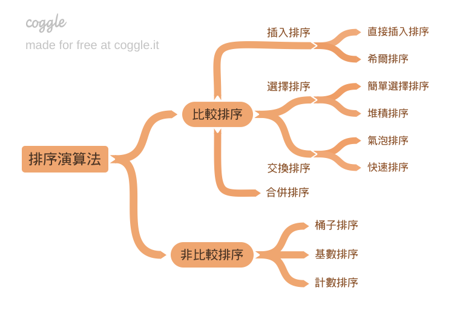

# Sorting Algorithm

這邊主要實作出十種常見排序演算法，通常將它們分成兩類：比較排序與非比較排序。比較排序是指排序的過程中需要比較某兩個元素的大小，非比較排序則透過其他手段進行排序（當然內部也會比較元素的大小，但這不是主要手段）。

```
排序演算法 (Sorting Algorithm)
├── 比較排序 (Comparison Sort)
│   ├── 插入排序 (Insertion Sort)
│   │   ├── 直接插入排序 (Straight Insertion Sort)
│   │   └── 希爾排序 (Shell Sort)
│   ├── 選擇排序 (Selection Sort)
│   │   ├── 簡單選擇排序 (Simple Selection Sort)
│   │   └── 堆積排序 (Heap Sort)
│   ├── 交換排序 (Exchange Sort)
│   │   ├── 氣泡排序 (Bubble Sort)
│   │   └── 快速排序 (Quick Sort)
│   └── 合併排序 (Merge Sort)
└── 非比較排序 (Non-comparison Sort)
    ├── 桶子排序 (Bucket Sort)
    ├── 基數排序 (Radix Sort)
    └── 計數排序 (Counting Sort)
```

<div style="max-width: 550px">


</div>
