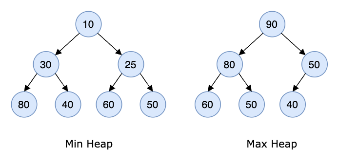
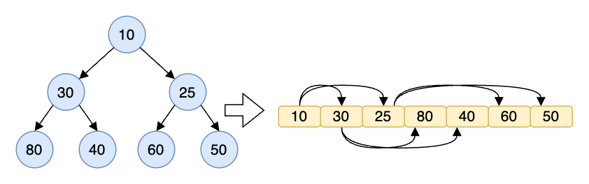
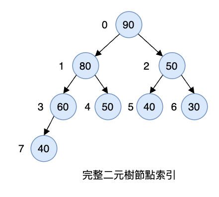
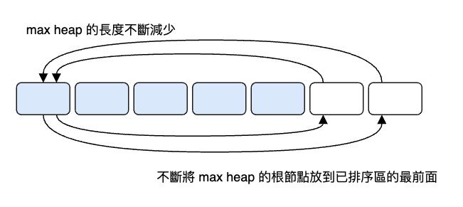

# 堆積與優先佇列 Heap and Priority Queue

不要被標題所迷惑，這個還是以 Tree 為基礎的資料結構。堆積（Heap）是一種根節點比子節點都來得大（或小）的樹，在這裡我們會介紹 binary heap。而優先佇列（Priority Queue）有很多實作方式，但最常見的就是使用 heap 來實作。

## 二元堆積 Binary Heap

二元堆積是一種特殊的二元樹，下面是它的三個特性：

1. 它是一顆完整二元樹，可以是空。
2. 樹的葉節點的值總是不大於或不小於其父節點的值。
3. 每一個節點的子樹也是一個二元堆積。

其中尤其是第二點，它決定了這個 heap 是最大堆積（max heap）或最小堆積（min heap）。

- 最大堆積（max heap）：根節點的值是所有節點中最大的，且每個節點的值都比其子節點的值大。
- 最小堆積（min heap）：根節點的值是所有節點中最小的，且每個節點的值都比其子節點的值小。

具體如圖所示：

<div align="center">
  
</div>

在 max heap 中，父節點的值總是大於或等於其子節點的值。而在 min heap 中，父節點的值總是小於或等於其子節點的值。這就是所謂的堆積屬性（min-heap or max-heap property），並且這個屬性對 heap 中的所有節點都成立。

根據這個屬性，我們可以得知在 max heap 的根節點是所有節點中最大的，而在 min heap 的根節點是所有節點中最小的。

我們可以用陣列來表示一個 heap，像是下面這張圖：

<div align="center">
  
</div>

上面這個 min heap: `[10, 30, 25, 80, 40, 60, 50]`，其實就是對樹進行廣度優先走訪的結果。

那如果一開始只給你這樣一個陣列，不給出樹的圖形，要怎麼知道哪一個節點是父節點哪一個是它的子節點呢？根據完整二元樹的特性，節點在陣列中的位置可以用下面的公式計算：

```js
parent(i) = Math.floor((i - 1) / 2)
left(i) = 2 * i + 1
right(i) = 2 * i + 2
```

`right(i)`  就是 `left(i) + 1`。左右節點總是處於相鄰的位置。我們把這個公式套用到下面的樹中驗證一下：

<div align="center">
  
</div>

| 節點 | 陣列索引 | `parent(i)` | `left(i)` | `right(i)` |
| ---- | -------- | ----------- | --------- | ---------- |
| 90   | 0        | null        | 1         | 2          |
| 80   | 1        | 0           | 3         | 4          |
| 50   | 2        | 0           | 5         | 6          |
| 60   | 3        | 1           | 7         | null       |
| 50   | 4        | 1           | null      | null       |
| 40   | 5        | 2           | null      | null       |
| 30   | 6        | 2           | null      | null       |
| 40   | 7        | 3           | null      | null       |

在 max heap 中，父節點的值總是大於或等於其子節點的值。所以下面的公式對陣列中任意一個索引值 `i` 都成立：

```js
array[parent(i)] >= array[i]
```

這些公式允許我們在不使用指標的情況下，就可以在陣列中找到節點的父節點和子節點。進行計算時只需要 $O(1)$ 的時間複雜度。

根據特性 1 我們還可以推導出節點數量與樹高的關係，因為我們必須填滿上一層，才能填下一層，每層的節點數量都是 2 的 n 次方，如 1, 2, 4, 8, 16...，所以有一個 heap 如果有 `n` 個節點，那麼它的樹高就是 `h = Math.floor(Math.log2(n))`。

例如上面的 `Math.floor(Math.log2(8)) = 3`，因為是從零開始算，所以是 4 層。

最下面的一層是葉節點，由於上面是滿的，共有 `n/2` 個節點。所以我們可以得知，一個 heap 的葉節點的索引值範圍是 `Math.floor(n/2) <= i <= n - 1`。

## 堆積排序 Heap Sort

heap sort 是指利用 heap 這種資料結構來實作的排序演算法，就是一個將二元樹轉換成 heap 的過程。

heap 的轉換過程與 selection sort 很像。回顧一下 selection sort 的過程，陣列被分為已排序的部分和未排序的部分，已排序的部分一開始是空的，然後每次從未排序的部分中找到最小的元素，並將它加入到已排序的部分中，直到未排序的部分被取完。我們可以發現未排序部分的最小元素就是已排序部分的最大元素。

selection sort 最差的情況下，時間複雜度是 $O(n^2)$，這是因為未排序的部分是沒有規律可言的，每次都要把裡面全部掃一遍。要想提高效率，就要讓未排序部分先轉換成某種規律的形式，藉此來提高尋找的效率。heap sort 就是先把一個無序的系統轉換成 heap，並且每次都把根節點（最小或最大的元素）取出，然後再次保持 heap 的特性。

heap sort 分成兩部分：

1. 將陣列轉成一個 heap。
2. 將 heap 的根節點取出並放到已排序的部分，再調整剩下的節點，使其成為一個新的 heap，然後重複這個過程，直到所有的節點都被取出。

先將原始陣列當成一個二元樹，然後從最後一個非葉節點開始著手，因為它與它的子節點最多形成一棵不超過 3 個節點的子樹。根據 `left(i) = 2i + 1; right(i) = 2i + 2` 的公式，我們很容易拿到這 3 個節點，然後交換它們的位置，使其成為 max heap 或是 min heap。這種知道父節點找到子節點的交換方式稱為元素下沉。

下沉的實作：首先判斷最大的子節點是左邊還是右邊，取出最大子節點的索引值，並且需要確認子節點有沒有超過陣列的長度。其次，讓父節點與最大的子節點比較，如果父節點比子節點小，就交換它們的位置，然後讓父節點繼續遞迴這個過程，直到子節點的長度超過陣列長度。

```js
function swap(array, a, b) {
  const temp = array[a];
  array[a] = array[b];
  array[b] = temp;
}

function maxHeapifyDown(array, index, heapSize) {
  let parent = index;
  while (parent < heapSize) {
    let left = 2 * parent + 1;
    let largest = null;

    if (left < heapSize) { // 存在左子節點（判斷是否越界）
      largest = left;
      let right = left + 1;
      if (right < heapSize && array[left] < array[right]) {
        // 存在右子節點，且比左子節點大
        largest = right;
      }
    }

    if (largest !== null && array[parent] < array[largest]) {
      swap(array, parent, largest);
      parent = largest; // 修正父節點的 index
    } else {
      break;
    }
  }
}
```

heap 建立完成後，`array[0]` 是最大的，我們將它放到最右側（升序排序），再將最右側的元素放到 `array[0]`。此時我們的 max heap 就會變回一般的二元樹，所以要再次將它轉換成 max heap。又因為我們在右邊的已排序區已經佔了一個元素，所以現在的 heap 長度要減 1。我們在不斷縮小的 max heap 中抽出最大的元素，並且放到已排序的區域，然後再次轉換成 heap ...這個過程如下圖所示：

<div align="center">
  
</div>

最後給出完整實作：

```js
function heapSort(array) {
  const n = array.length;
  // 陣列現在分成兩區，左側是 max heap，右側是已排序的元素
  for (let i = n >> 1; i >= 0; i--) {
    maxHeapifyDown(array, i, n); // 找到最後一個非葉節點並將其與子節點比較
  }

  // 現在 array[0] 是 heap 的根節點，也就是最大的元素
  for (let i = n - 1; i > 0; i--) {
    swap(array, 0, i); // 將最大元素移動到已排序區的最前面
    maxHeapifyDown(array, 0, i); // 將剩下的元素重新構建成 max heap
    console.log(array); // 可以在這打一個 log 看看排序的過程
  }
}
```

上面的排序稱為 max heap sort，接著我們來看看 min heap sort 的實作：

```js
function minHeapifyDown(array, index, heapSize) {
  let parent = index;
  while (parent < heapSize) {
    let left = 2 * parent + 1;
    let smallest = null;

    if (left < heapSize) {
      smallest = left;
      let right = left + 1;
      if (right < heapSize && array[left] > array[right]) {
        // 存在右子節點，且比左子節點小
        smallest = right;
      }
    }

    if (smallest !== null && array[parent] > array[smallest]) {
      // 讓父節點與最小的子節點交換，確保值小的在上面
      swap(array, parent, smallest);
      parent = smallest; // 修正父節點的 index
    } else {
      break;
    }
  }
}

function heapSort2(array) {
  const n = array.length;
  // 陣列現在分成兩區，左側是 min heap，右側是已排序的元素
  for (let i = n >> 1; i >= 0; i--) {
    minHeapifyDown(array, i, n);
  }

  for (let i = n - 1; i > 0; i--) {
    swap(array, 0, i);
    minHeapifyDown(array, 0, i);
  }
}
```

但此時會發現得到的是一個降序的結果，所以我們不能直接複製貼上之前的程式碼。我們可以先複製一個陣列，建構成一個 min heap，然後再將元素從 min heap 中取出，放到陣列第 `i` 個位置，然後調整縮小 min heap：

```js
function popMin(heap, heapSize) {
  const min = heap[0];
  heap[0] = heap[heapSize - 1];
  minHeapifyDown(heap, 0, heapSize - 1);
  return min;
}

function heapSort2(array) {
  const n = array.length;
  const heap = [...array];

  for (let i = n >> 1; i >= 0; i--) {
    minHeapifyDown(heap, i, n);
  }

  // 依序從 heap 中取出最小的元素覆蓋到 array 中對應的位置
  for (let i = 0; i < n; i++) {
    array[i] = popMin(heap, n - i);
  }
}
```

## TopK 問題

TopK 問題是一個經典的大量資料處理問題，例如前十熱銷商品、學校期中考前三名等等，從一堆亂序的資料中找出前 K 大或前 K 小的元素都被歸類為 TopK 問題。

這個問題有許多解法，例如直接暴力排序後再取值、quick select、priority queue（JavaScript 沒有內建，它也是用 min heap 實作的），還有使用 min heap 或 max heap 的解法。

我們先來看看取第 K 大的元素，程式碼如下：

```js
function findKthLargest(array, k) { // k 從 0 開始
  const n = array.length;
  for (let i = Math.floor(n / 2); i >= 0; i--) {
    maxHeapifyDown(array, i, n);
  }

  if (k === 0) {
    console.log(array);
    return array[0];
  }
  k--;
  for (let i = n - 1; i > 0; i--) {
    swap(array, 0, i);
    maxHeapifyDown(array, 0, i);
    if (k-- === 0) {
      return array[0];
    }
  }
}
```

如果求最大的 K 個元素，我們可以先建立一個長度為 K 的 min heap，然後將陣列中剩下的元素逐一與 min heap 的根節點比較，如果比根節點大，就把根節點取出，並且把新元素放到根節點的位置，然後再次調整 min heap，直到所有元素都遍歷完畢，剩下在 min heap 中的元素就是最大的 K 個元素。

```js
function findLargest(array, k) {
  const n = array.length;
  const result = array.slice(0, k);

  for (let i = k >> 1; i >= 0; i--) {
    minHeapifyDown(result, i, k);
  }

  for (let i = k; i < n; i++) {
    if (result[0] < array[i]) {
      result[0] = array[i];
      minHeapifyDown(result, 0, k);
    }
  }

  return result;
}

const result = findLargest([3, 11, 1, 5, 6, 9, 7, 8], 4);
console.log(result); // [ 7, 9, 8, 11 ] 注意這裡不是排序的結果，只是最大的 4 個元素
```

因為僅保存了 K 個元素，調整 min heap 的時間複雜度是 $O(\log K)$，所以整體的時間複雜度是 $O(n \log K)$。

## 優先佇列 Priority Queue

首先我們來回憶一下佇列，普通的佇列是一種先進先出（FIFO）的資料結構，元素只能從佇列尾部加入，從佇列頭部取出。而優先佇列（Priority Queue）是一種特殊的佇列，它的元素是有優先級的，有最高優先級的元素會被最先取出，就像 VIP，就算他最晚來，也會被優先服務。

既然 VIP 需要最先得到服務，我們需要將優先級最高的元素在加入佇列時就調整到最前面，如果使用 linked list 或是普通陣列來實作，時間複雜度會是 $O(n)$；如果換成 max heap 或 min heap，每次加入和取出的時間複雜度都是 $O(\log n)$。我們在上面已經學過如何構建 heap 和調整 heap，而想要實作一個 priority queue，還需要實作 heap 的移除與新增元素的方法。

先來看一下 priority queue 的 API：

```js
class PriorityQueue {
  heap = [];

  push() {} // 新增元素，調整 heap

  pop() {} // 彈出最大元素，調整 heap

  peek() { // 回傳最大元素
    return this.heap[0];
  }

  size() {
    return this.heap.length;
  }

  isEmpty() {
    return this.heap.length === 0;
  }

  toString() {
    return this.heap.toString();
  }
}
```

困難的地方在新增與刪除元素兩個方法。我們先來看看新增元素，一般是將元素放到最後，然後讓它上浮到適當的位置。元素上浮是“孩子要去找父親”，父節點是基於 `parent = (child - 1) >> 1` 計算出來的。我們現在要實作一個 max heap 的 priority queue，因此如果子節點比父節點大，就交換它們的位置，然後繼續上浮，直到無法交換為止。

push 方法實作如下：

```js
push(el) {
  const array = this.heap;
  array.push(el);
  let child = array.length - 1;
  let parent = (child - 1) >> 1;

  while (array[child] > array[parent]) {
    swap(array, child, parent); // 讓大的元素往上浮
    child = parent;
    parent = (child - 1) >> 1;
  }
}
```

再來看刪除元素，我們只刪除優先級最高的，也就是第一個元素，當然也可以刪除指定的元素，只要找到目標元素後，就將它與最後一個元素交換。這時要保證新的第一個元素的優先級是最高的，又不能影響到最後一個，所以我們要從第一個元素開始下沉，當我們的元素碰到目標元素後就停止，最後把元素刪除。

pop 方法實作如下：

```js
pop(el) {
  const array = this.heap;
  let index = 0;
  for (let i = 0; i < array.length; i++) {
    if (array[i] === el) {
      index = i;
      break;
    }
  }

  const target = array[index];
  swap(array, index, array.length - 1);

  // 從父節點開始下沉 (陣列的右邊方向)
  let parent = 0;
  let child = parent * 2 + 1;
  while (true) {
    if (array[child] < array[child + 1] && array[child + 1] !== target) {
      child++;
    }

    if (array[parent] < array[child] && array[child] !== target) {
      swap(array, parent, child);
      parent = child;
      child = parent * 2 + 1; // 不斷向右
    } else {
      break;
    }
  }

  return array.pop();
}
```

我們可以試著執行一下下面的程式碼，可以發現 heap 值並不是完全按照順序排列的，它只保證第一個值是最大的：

```js
const pq = new PriorityQueue();

pq.push(1);
pq.push(3);
pq.push(20);
pq.push(5);

console.log(pq.toString()); // 20,5,3,1

pq.push(30);

console.log(pq.toString()); // 30,20,3,1,5

pq.push(25);

console.log(pq.toString()); // 30,20,25,1,5,3

pq.pop();

console.log(pq.toString()); // 25,20,3,1,5

pq.pop(3);

console.log(pq.toString()); // 25,20,5,1
```

透過 priority queue 我們可以很容易地解決前面的 TopK 問題，只要把陣列中的元素全部加入 priority queue，然後再從 priority queue 中 pop 出前 K 個元素即可。

最後再讓我們來實作一下以 min heap 為基礎的 priority queue，其實也非常簡單，只要在 pop 與 push 涉及元素比較的地方將大於和小於符號對調即可。具體程式碼如下：

```js
class MinPriorityQueue extends PriorityQueue {
  constructor() {
    super();
  }

  push(el) {
    const array = this.heap;
    array.push(el);
    let child = array.length - 1;
    let parent = (child - 1) >> 1;

    while (array[child] < array[parent]) {
      swap(array, child, parent); // 讓小的元素往上浮
      child = parent;
      parent = (child - 1) >> 1;
    }
  }

  pop(el) {
    const array = this.heap;
    let index = 0;
    for (let i = 0; i < array.length; i++) {
      if (array[i] === el) {
        index = i;
        break;
      }
    }

    const target = array[index];
    swap(array, index, array.length - 1);

    let parent = 0;
    let child = parent * 2 + 1;
    while (true) {
      if (array[child] > array[child + 1] && array[child + 1] !== target) {
        child++;
      }

      if (array[parent] > array[child] && array[child] !== target) {
        swap(array, parent, child);
        parent = child;
        child = parent * 2 + 1;
      } else {
        break;
      }
    }

    return array.pop();
  }
}
```

## Ugly Number

Ugly number 是一個質因數只包含 2, 3, 5 的正整數，並且我們將 1 當作第一個 ugly number。給你一個整數 `n`，請你求出第 `n` 個 ugly number。也就是要從符合條件的 ugly number 數列中如：1, 2, 3, 4, 5, 6, 8, 9, 10, 12...，找出第 `n` 個數字。

Example 1:

```text
Input: n = 10
Output: 12
Explanation: 1, 2, 3, 4, 5, 6, 8, 9, 10, 12 is the sequence of the first 10 ugly numbers.
```

Example 2:

```text
Input: n = 1
Output: 1
```

稍微分析一下後，我們觀察到除了第一個數字 1 以外，其他的數字都是乘以 2、3、5 得出的，在每次相乘得到的數中，移除被乘數後，找到最小的數，繼續乘以 2、3、5。也就是：

```text
[2, 3, 5] => 彈出 2，然後乘以 2、3、5 得到 4, 6, 10 加入佇列
[3, 5, 4, 6, 10] => 彈出 3，乘以 2、3、5 加入佇列
[4, 5, 6, 10, 6, 9, 15] => priority queue 會將最小的浮上去，然後彈出 4 繼續同樣操作
```

我們可以看到會有重複的數字出現，我們可以利用 hash table 來去除重複的數字，並且使用 MinPriorityQueue 來確保每次取出的數字都是最小的。程式碼如下：

```js
function nthUglyNumber(n) {
  const hash = new Set();
  const queue = new MinPriorityQueue();
  queue.push(1);
  hash.add(1);

  const factors = [2, 3, 5];
  let result = 1;
  for (let i = 0; i < n; i++) {
    result = queue.pop();
    for (const factor of factors) {
      const next = result * factor;
      if (!hash.has(next)) {
        hash.add(next);
        queue.push(next);
      }
    }
  }

  return result;
}
```

## 總結

binary heap 是 priority queue 的實現方式之一，它有兩個特性：

1. 它是一棵完整二元樹，因此完整二元樹的特性也適用於它。
2. 每個節點都比其子節點大（或小）。

JavaScript 沒有內建 priority queue，因此需要自己封裝一個。

heap sort 是一種利用 heap 來實現的排序演算法，它的時間複雜度是 $O(n \log n)$，空間複雜度是 $O(1)$。

TopK 問題很適合使用 heap 來解決，建立 heap 的時間複雜度 $O(n)$，加入元素和取出元素的時間複雜度都是 $O(\log K)$。
