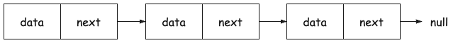
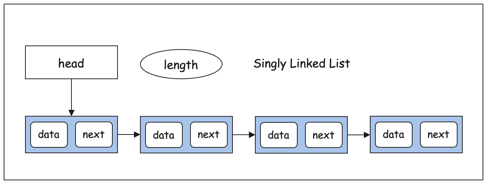

# 鏈結串列 Linked List

JavaScript 並沒有內建 Linked List，我們可以想像成它是一個個連接起來的物件，每個物件都有一個 `next` 屬性指向下一個物件。從記憶體的角度來看，它是不連續分配的，每個物件都可以散落在記憶體的任何地方。

Linked list 也分成很多種，它本身是複合資料結構，最基本單位是節點（Node），每個節點都有兩個屬性，一個是資料（data），另一個是指向下一個節點的指標（pointer）。如下圖所示：



對於這個 Node，可以用下面的程式碼表示：

```js
class Node {
  constructor(element) {
    this.element = element;
    this.next = null;
  }
}
```

為了方便使用，通常會為 Linked List 加上一些和陣列同樣功能的方法與屬性，用於增刪改查。

## 單向鏈結串列 Singly Linked List

Singly Linked List 是最簡單的一種 Linked List，特色是每兩個節點之間只有一個單向的連結。想像一群小朋友需要有序的入場，為了防止人員走散，後面的人都會拉著前面的人的衣服（next），依此構建了如下圖所示的一個 Singly Linked List：



Singly Linked List 通常包含如下操作：

- **head**：插入節點的起點。
- **insertAt(index, data)**：插入一個節點到指定位置。
- **removeAt(index)**：移除指定位置的節點。
- **findIndex(index)**：尋找一個節點。
- **forEach(cb)**：遍歷所有節點。
- **size**：回傳串列長度。
- **isEmpty**：判斷串列是否為空。
- **clear**：清空所有資料。

實作程式碼如下：

```js
class List {
  constructor() {
    this.head = null;
    this.length = 0;
  }

  size() {
    return this.length;
  }

  isEmpty() {
    return this.size() === 0;
  }

  clear() {
    this.head = null;
    this.length = 0;
  }

  forEach(cb) {
    let current = this.head;
    let index = 0;
    while (current) {
      cb(current.element, index++);
      current = current.next;
    }
  }

  findIndex(index) {
    let current = this.head;
    let i = 0;
    while (current) {
      if (index === i) {
        return current;
      }
      current = current.next;
      i++;
    }
    return null;
  }

  insertAt(index, element) {
    if (index >= 0 && index <= this.length) {
      const node = new Node(element);
      if (index === 0) {
        const current = this.head;
        node.next = current;
        this.head = node;
      } else {
        const prev = this.findIndex(index - 1);
        node.next = prev.next;
        prev.next = node;
      }
      this.length++;
    } else {
      throw `${index} 超過 list 長度 ${this.length}`;
    }
  }

  removeAt(index) {
    if (this.head && index >= 0 && index < this.length) {
      const prev = this.findIndex(index - 1);
      const current = this.findIndex(index);
      if (!prev) { // 前面沒有節點，代表要移除的是第一個
        this.head = current.next;
      } else {
        prev.next = current.next;
      }
      this.length--;
    } else {
      throw `${index} 超過 list 長度 ${this.length}`;
    }
  }
}

const list = new List();
list.insertAt(0, 111);
list.insertAt(1, 222);
list.insertAt(1, 333);
list.insertAt(3, 444);
list.forEach((el, i) => console.log(el, i));
try {
  list.insertAt(8, 333);
} catch (error) {
  console.log(error);
}
list.removeAt(1);
list.forEach((el, i) => console.log(el, i));
```

讓我們把它拿來跟陣列做比較，由於 Linked list 沒有索引這種可以一次到位的“神器”，要存取某個元素都必須遍歷整串 list，所以時間複雜度是 O(n)，但是在增刪元素時，Linked list 的效率就比陣列高了，因為它不需要像陣列一樣，把後面的元素都往後移動，只需要改變指標的指向就可以了，所以時間複雜度是 O(1)。

## [雙向鏈結串列 Doubly Linked List](./doubly-linked-list/)

## [有排序的鏈結串列 Sorted Linked List](./sorted-list/)

## [環狀鏈結串列 Circular Linked List](./circular-linked-list/)

## [鏈結串列排序演算法 Linked List Sorting](./sorting/)
