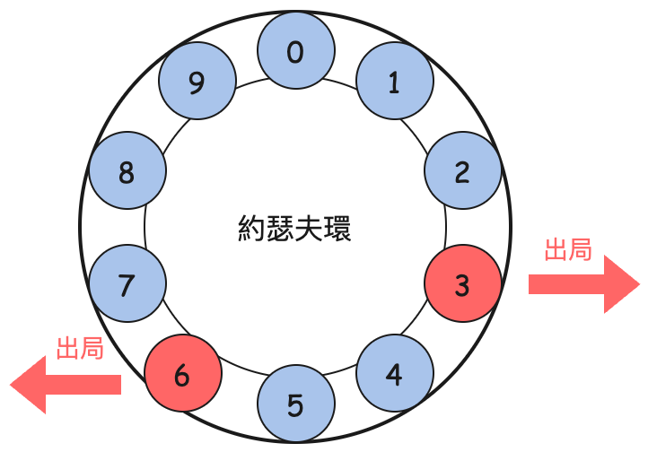
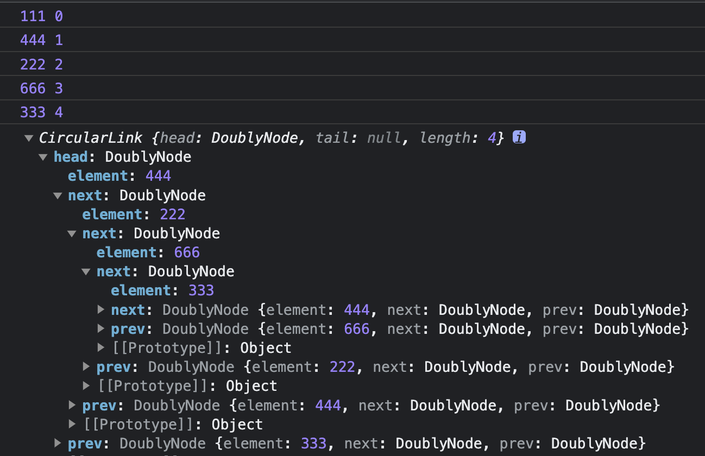

## 環狀鏈結串列 Circular Linked List

有一道非常有名的面試題：約瑟夫問題（Josephus problem），會使用到環狀鏈結串列。

先了解一下規則：在一個房間裡有 n 個人（編號 0 ~ n-1），只能有最後一個人活下來。按照如下的規則進行：

1. 所有人圍成一圈。
2. 順時針報數，每次報到 q 的人將被移出。
3. 從下一個人開始重新報數，重複步驟 2 直到只剩下一個人。

所描述的規則可以用下圖的約瑟夫環來表示：

<div>
  
</div>

接下來你要做的就是：當你在這一群人之間時，你必須選擇一個位置讓你成為剩餘的最後一人。

這看起來很困難，但是有了環狀鏈結串列，就很好解決了。首先在雙向鏈結串列的 head 與 tail 是不同的節點，而環狀鏈結串列的這兩個都指向同一處。既然如此我們只保持一個 head 就足夠了。其次，forEach 與 find 方法需要做一下處理避免無限迴圈。因為只有一個節點的環狀鏈結串列，它的 next 和 prev 都會指向自己。

來看一下雙向鏈結串列和環狀鏈結串列的 forEach 方法：

```js
// 雙向鏈結串列
forEach(cb) {
  let current = this.head;
  let i = 0;
  while (current) {
    cb(current.element, i);
    current = current.next;
    i++;
  }
}

// 環狀鏈結串列
forEach(cb) {
  let current = this.head;
  let first = this.head;
  let i = 0;
  while (current) {
    cb(current.element, i);
    current = current.next;
    if (current === first) {
      break; // 迴圈結束
    }
    i++;
  }
}
```

我們模仿實作有序鏈結串列的時候，讓它繼承雙向鏈結串列，然後重寫 forEach、findIndex、insertAt 與 removeAt 方法：

```js
class CircularLink extends DoublyList {
  forEach(cb) {
    let current = this.head;
    let first = current;
    let i = 0;
    while (current) {
      cb(current.element, i);
      current = current.next;
      if (current === first) {
        break;
      }
      i++;
    }
  }

  findIndex(index) {
    const n = this.length;
    if (index > n) {
      return null;
    }
    // 判斷尋找方向
    const dir = index > n >> 1;
    let current = dir ? this.head.prev : this.head;
    let first = current;
    let prop = dir ? 'prev' : 'next';
    let add = dir ? -1 : 1;
    let i = dir ? n - 1 : 0;

    while (current) {
      if (index === i) {
        return current;
      }
      current = current[prop];
      if (current === first) {
        return current;
      }
      i += add;
    }

    return null;
  }

  insertAt(index, element) {
    if (index <= this.length) {
      const node = new DoublyNode(element);

      if (index === 0 && !this.head) {
        this.head = node;
        node.prev = node;
        node.next = node;
      } else {
        let prev = this.findIndex(index - 1);
        let next = prev.next;

        prev.next = node;
        node.prev = prev;
        node.next = next;
        next.prev = node;
      }

      this.length++;
    }
  }

  removeAt(index) {
    const node = this.findIndex(index);
    if (node) {
      if (node.next === node) {
        this.head = null;
      } else {
        let prev = node.prev;
        let next = node.next;
        prev.next = next;
        next.prev = prev;

        if (node === this.head) {
          this.head = next;
        }
      }
      this.length--;
      return true;
    }
    return false;
  }
}

const list = new CircularLink();

list.insertAt(0, 111);
list.insertAt(1, 222);
list.insertAt(2, 333);
list.insertAt(1, 444);
list.insertAt(3, 666);

list.forEach((el, i) => console.log(el, i));

list.removeAt(0);
console.log(list);
```

實際執行上面的程式碼後可以在控制台看到如圖的輸出：

<div>
  
</div>

現在讓我們來解決約瑟夫問題，這個問題主要思路來自 `forEach` 與 `remove` 方法。我們先建立一個環狀的 list 與一個不斷遞迴呼叫的 `kill` 方法，`kill` 在只剩一個人時停止，如何判定只剩一個人，可以用 `node.next === node` 或 `list.length === 1` 來判斷。

```js
function kill(list, node, m) {
  let i = 1;
  while (i <= m) {
    if (i === m) {
      if (node.next === node) {
        console.log('最後一個', node.element);
        return true;
      }
      let prev = node.prev;
      let next = node.next;
      prev.next = next;
      next.prev = prev;
      list.length--;

      if (node === list.head) {
        list.head = next;
      }
      console.log('出局', node.element);
    }
    i++;
    node = node.next;
  }
  kill(list, node, m);
}

function josephus(n, m) {
  const list = new CircularLink();
  for (let i = 0; i < n; i++) {
    list.insertAt(i, i + 1);
  }
  kill(list, list.head, m);

  return list.head.element;
}
```
