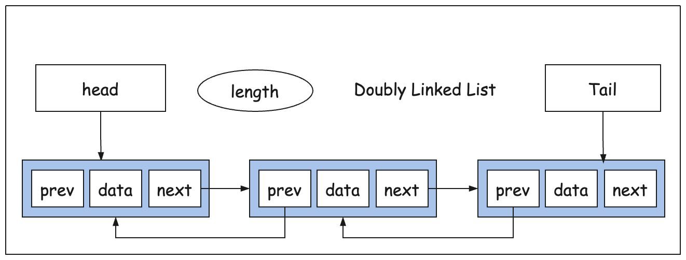

## 雙向鏈結串列 (Doubly Linked List)

雙向鏈結串列的每一個節點比起單向鏈結串列多了一個指向前一個節點的指標（prev），list 本身也多了一個 tail 屬性指向最後一個節點。每次在增刪節點時，我們會呼叫一個更快的 `findIndex` 方法，它會根據傳入的索引值決定是從頭或尾開始搜尋。

Doubly Linked List 可以想像成幾個人站成一排，但不是手拉手，左邊的人用右手（next）拉右邊的人的衣角，右邊的人用左手（prev）拉左邊的人的衣角。如果從中間插入一個人，就要斷開重連，此時涉及 4 個屬性的修改。

可以參考這個示意圖：



實作程式碼如下：

```js
class DoublyNode {
  constructor(element) {
    this.element = element;
    this.next = null;
    this.prev = null;
  }
}

class DoublyList {
  constructor() {
    this.head = null;
    this.tail = null;
    this.length = 0;
  }

  size() {
    return this.length;
  }

  clear() {
    this.head = null;
    this.tail = null;
    this.length = 0;
  }

  isEmpty() {
    return this.size() === 0;
  }

  getHead() {
    return this.head;
  }

  getTail() {
    return this.tail;
  }

  findIndex(index) {
    const n = this.length;
    if (index > n) {
      throw `Index ${index} is greater than list size ${n}`;
    }
    // 判斷查詢方向
    const dir = index > n >> 1;
    let current = dir ? this.tail : this.head;
    let prop = dir ? 'prev' : 'next';
    let add = dir ? -1 : 1;
    let i = dir ? n - 1 : 0;
    while (current) {
      if (index === i) {
        return current;
      }
      current = current[prop];
      i = i + add;
    }
    return null;
  }

  forEach(cb) {
    let current = this.head;
    let i = 0;
    while (current) {
      cb(current.element, i);
      current = current.next;
      i++;
    }
  }

  insertAt(index, element) {
    if (index <= this.length) {
      let node = new DoublyNode(element);

      if (index === 0 && !this.head) {
        this.tail = this.head = node;
      } else {
        let prev = this.findIndex(index - 1);
        if (!prev) {
          // 前面節點不存在，說明插入的是第一個節點，把 head 指向新節點
          node.next = this.head;
          this.head.prev = node;
          this.head = node;
        } else {
          let curr = prev.next; // curr 如果不存在代表從尾部插入
          prev.next = node;
          node.prev = prev;

          node.next = curr;
          if (curr) {
            curr.prev = node;
          }
        }
      }

      if (index === this.length) {
        this.tail = node;
      }

      this.length++;
    } else {
      throw `Index ${index} is greater than list size ${this.length}`;
    }
  }

  removeAt(index) {
    if (this.head && index < this.length) {
      let prev = this.findIndex(index - 1);
      let curr = this.findIndex(index);
      let next = curr.next;

      if (!prev) {
        // 前面節點不存在，說明移除的是第一個節點，把 head 指向下一個節點
        this.head = next;
      } else {
        prev.next = next;
      }

      if (next) {
        // 如果 next 存在，說明移除的不是最後一個節點，把 next 的 prev 指向 prev
        next.prev = prev;
      } else {
        // 如果 next 不存在，說明移除的是最後一個節點，把 tail 指向 prev
        this.tail = prev;
      }

      this.length--;
      return curr.element;
    }

    return null;
  }
}

const list = new DoublyList();

list.insertAt(0, 111);
list.insertAt(1, 222);
list.insertAt(2, 333);
list.insertAt(3, 444);
list.insertAt(4, 555);
list.insertAt(5, 666);
list.insertAt(0, 888);

list.forEach((el, i) => console.log(el, i));

try {
  list.insertAt(10, 777);
} catch (error) {
  console.log(error);
}

list.removeAt(1);
list.forEach((el, i) => console.log(el, i));

```
