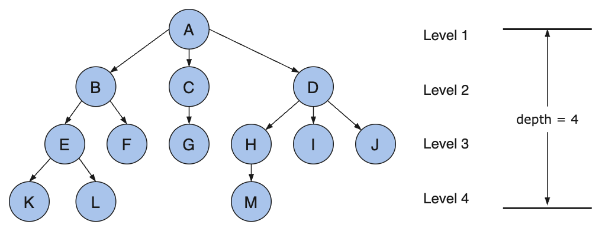
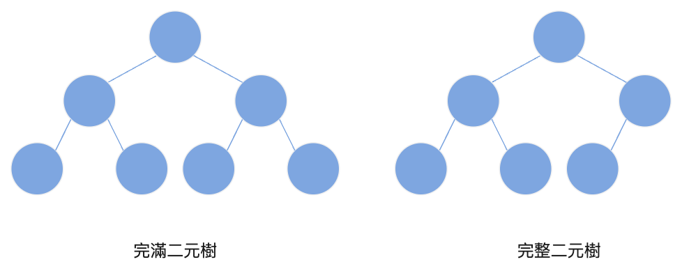
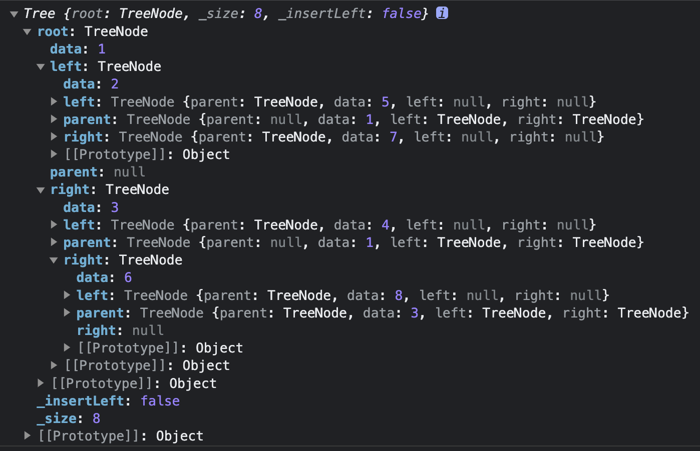

# 樹與二元樹 Tree and Binary Tree

Tree 是計算機編程中最重要、最核心的一種資料結構。樹狀結構是日常生活中廣泛存在的一種結構，例如族譜、公司組織架構等等。在程式設計中，Tree 更是無處不在，例如瀏覽器的 DOM、文件系統、編譯器中的語法樹也是一種樹。

而 Tree 這種資料結構，最經典、最基礎的例子就是二元樹（Binary Tree）。掌握好二元樹是學習其他樹狀結構的基石。

## 樹的常見術語

鏈結串列的每個節點都是物件，它由一個 next 屬性指向下一個節點，而樹是由多個屬性指向多個節點，然後每個節點都是同一種結構。整體結構可以參考附圖。

以前端人最熟悉的 HTML DOM Tree 為例：html 就是樹，然後它有兩個孩子 head 和 body，我們可以透過 `html.firstChild`、`html.lastChild` 存取它們。然後他們也可以透過 `parentNode` 存取到 html。head 裡也有許多元素節點。為了方便管理元素，瀏覽器提供了一個 `children` 屬性，裝載了某個元素的所有子元素節點。

<div align="center">
  
  <p>樹的整體結構</p>
</div>

接著來學習一下樹的基本術語：

- **節點（Node）**：指樹中的一個元素。
- **分支度（Degree）**：指節點擁有的子樹的個數，二元樹的分支度不大於 2。
- **階層（Level）**：從根節點開始，根節點的階層為 1，根節點的子節點的階層為 2，以此類推。
- **兄弟節點（Siblings）**：具有相同父節點的節點互相稱為兄弟節點。如上圖：B、C、D 互為兄弟節點。
- **父節點（Parent）**：若一個節點含有子節點，則此節點稱為其子節點的父節點。如上圖：B 為 E 的父節點。
- **子節點（Child）**：如果此節點有上層節點，則此節點稱為其上層節點的子節點。如上圖：G 為 C 的子節點。
- **根節點（Root）**：沒有父節點的節點稱為根節點。如上圖：A。
- **葉節點（Leaf）**：沒有子節點的節點。如上圖：K、L、F、G、M、I、J。
- **非終端節點（Non-terminal Nodes）**：除了樹葉節點之外，其他都是非終端節點。
- **樹高（Height）或樹深（Depth）**：樹的最大階層數。
- **祖先節點（Ancestors）**：指某節點到根節點之間所經過的所有節點。
- **子孫節點（Descendants）**：以某節點為根的子樹中的所有節點。

## 二元樹 Binary Tree

樹的分類有很多種，但基本上都是二元樹的衍生。二元樹顧名思義，就是每個節點最多只能有兩個子節點的樹，這兩個子樹被稱為左子樹和右子樹。而左右子樹也必須是二元樹，並且次序不能任意顛倒。

二元樹是遞迴定義的，所以一般二元樹的相關題目也都可以使用遞迴的思想來解決。當然也有一些可以使用非遞迴的方法解決。

二元樹有 3 種型態：歪斜樹、完滿二元樹、完整二元樹。

- **歪斜樹（Skewed Tree）**：所有節點都只有左子樹（左歪斜樹）或都只有右子樹（右歪斜樹），應用不多。其實也可以看成是鏈結串列。
- **完滿二元樹（Full Binary Tree）**：所有的分支節點都存在左子樹和右子樹，且所有葉節點都在同一層上。關鍵在於樹的平衡，根據完滿二元樹的定義，得到的特點如下：
  - 葉節點只能出現在最下層，出現在其他層就不可能達成平衡。
  - 非葉節點的分支度一定是 2。
  - 在同樣深度的二元樹中，完滿二元樹的節點個數最多，葉子樹最多。
  - 節點個數的計算公式：$2^h - 1$，其中 h 為樹高。
- **完整二元樹（Complete Binary Tree）**：對一棵具有 n 個節點的二元樹按層序編號，如果編號為 i 的節點與同樣深度的完滿二元樹中編號為 i 的節點在二元樹中的位置完全相同，那麼它就是完整二元樹。完滿二元樹一定是完整二元樹，但完整二元樹不一定是完滿二元樹。兩者結構示意圖如下：

<div align="center">
  
  <p>完滿二元樹與完整二元樹示意圖</p>
</div>

二元樹的主要方法如下：

- 建立
- 新增節點
- 移除節點
- 尋找節點
- 取得樹高
- 取得樹的節點數
- 各種走訪（遍歷）方式

二元樹的許多方法是遞迴實現的，實作程式碼如下：

```js
class TreeNode {
  constructor(data) {
    this.parent = null;
    this.data = data;
    this.left = null;
    this.right = null;
  }
}

class Tree {
  constructor() {
    this.root = null;
    this._size = 0;
  }

  insert(data) {}

  remove(data) {}

  size() {}

  minNode() {}

  maxNode() {}

  min() {}

  max() {}

  getNodeSize() {}

  height() {}

  getNodeHeight() {}
}
```

### Tree 的插入操作

我們新增一個私有屬性 `_insertLeft`，用來決定資料插入的位置。首先，我們需要判斷它有沒有左子樹節點：沒有則插入左邊，如果有則插入右邊。如果這個節點滿了，那就要選擇是從左子樹還是右子樹繼續往下找。我們通過 `_insertLeft` 來決定是往左邊還是右邊，可以這次是左邊，下次是右邊，每次執行前修改 `_insertLeft` 的值。

```js
constructor() {
  this.root = null;
  this._size = 0;
  this._insertLeft = false;
}

insert(data) {
  const dir = (this._insertLeft = !this._insertLeft); // 插入方向

  function insertIt(node, data) {
    if (node.data === data) {
      return false;
    } else if (!node.left) {
      node.left = new TreeNode(data);
      node.left.parent = node;
      return true;
    } else if (!node.right) {
      node.right = new TreeNode(data);
      node.right.parent = node;
      return true;
    } else {
      if (dir === true) {
        return insertIt(node.left, data); // 遞迴
      }
      return insertIt(node.right, data); // 遞迴
    }
  }

  let ret = false;
  if (!this.root) {
    this.root = new TreeNode(data);
    ret = true;
  } else {
    ret = insertIt(this.root, data);
  }

  if (ret) {
    this._size++;
  }

  return ret;
}

const tree = new Tree();
tree.insert(1);
tree.insert(2);
tree.insert(3);
tree.insert(4);
tree.insert(5);
tree.insert(6);
tree.insert(7);
tree.insert(8);
console.log(tree);
```

執行一下上面的程式碼，在控制台確認一下結果：

<div align="center">
  
  <p>二元樹插入操作</p>
</div>

### Tree 的搜尋操作

在開始刪除操作之前，我們需要先實作一個搜尋方法，傳入 data，有與之對應的資料就回傳該節點，沒有就回傳 null。 由於我們的樹的資料是沒有放置規則的，所以只能全部遞迴搜尋一遍。

```js
find(data) {
  let ret = null;

  function findIt(node, data) {
    if (node) {
      if (node.data === data) {
        ret = node;
      } else {
        findIt(node.left, data);
        findIt(node.right, data);
      }
    }
  }

  findIt(this.root, data);
  return ret;
}
```

### Tree 的刪除操作

刪除可以算是二元樹最為複雜的操作，因為刪除節點後，樹的結構會發生變化，所以刪除操作需要考慮很多情況。

1. 被刪除的節點是葉節點。
2. 被刪除的節點只有左子節點。
3. 被刪除的節點只有右子節點。
4. 被刪除的節點有左右子節點。

在刪除時上面四種情況都必須考慮進去，並且這四種情況還有更細的劃分。實作程式碼如下：

```js
remove(data) {
  const node = this.find(data);
  if (node) {
    this._size--;
    if (node === this.root) {
      this.root = null;
      return true;
    }

    let left = node.left;
    let right = node.right;
    let parent = node.parent;
    let isLeft = parent && parent.left === node;

    if (!left && !right) { // 沒有子節點
      // todo 1
    } else if (left && !right) { // 只有左子節點
      // todo 2
    } else if (!left && right) { // 只有右子節點
      // todo 3
    } else if (left && right) { // 有左右子節點
      // todo 4
    }
  }
}
```

(1) 如果被刪除的節點是葉節點，直接刪掉就好了，具體操作是判斷它是父節點哪一邊的子節點，然後將父節點的對應屬性設為 null。

```js
if (isLeft) {
  parent.left = null;
} else {
  parent.right = null;
}
```

(2) 被刪除的節點只有左子節點。

```js
if (isLeft) {
  parent.left = left;
} else {
  parent.right = left;
}
left.parent = parent;
```

當被刪除的節點只有一個子節點時，我們只需要將子節點提升到被刪除的節點的位置即可。只是在最後一步，我們需要將子節點的 parent 屬性指向被刪除節點的 parent 屬性。

(3) 被刪除的節點只有右子節點，這種情況跟第二種情況類似：

```js
if (isLeft) {
  parent.left = right;
} else {
  parent.right = right;
}
right.parent = parent;
```

(4) 被刪除的節點有兩個子節點，這種情況最為麻煩，如果我們隨便選擇一個子節點來替代被刪除的節點，那麼這個分支上就只有一個子節點了。一個完整的二元樹不能在中間出現只有一個子節點的情況。因此，我們可以在被刪除節點的“孩子”裡找到一個葉節點，先讓它替代被刪除的節點，然後再刪除這個葉節點。

```js
let child = right;
while (child.left) {
  child = child.left;
}
this.remove(child.data);
node.data = child.data;
```

這樣一來 `remove` 方法就成功了，但有許多可以改進的地方，我們可以將一些重複的程式碼獨立出來，例如連接被刪節點的“子節點”和“父節點”這一步，可以寫成一個 `transplant` 方法：

```js
transplant(node, child) {
  if (node.parent == null) {
    this.root = child;
  } else if (node === node.parent.left) {
    node.parent.left = child;
  } else {
    node.parent.right = child;
  }
  if (child) {
    child.parent = node.parent;
  }
}
```

移除的方法可以弄成幾個分支：有兩個子節點，只有一個子節點，沒有子節點。程式碼如下：

```js
remove(data) {
  const node = this.find(data);
  if (node) {
    this.removeNode(node);
    this._size--;
  }
}

removeNode(node) {
  // 如果有兩個子節點
  if (node.left !== null && node.right !== null) {
    let succ = null;
    for (succ = node.right; succ.left !== null; succ = succ.left); // 找到後繼
    node.data = succ.data; // 用後繼的值替換當前節點的值
    this.removeNode(succ); // 遞迴刪除，只可能遞迴一次
  } else {
    // 葉節點或只有一個子節點
    let child = node.left || node.right || null;
    this.transplant(node, child);
  }
}
```

### 求最大值和最小值

如果這個二元樹是一個二元搜尋樹（BST），那麼最大值和最小值就是最右邊的葉節點和最左邊的葉節點：

```js
minNode(node) {
  let current = node || this.root;
  while (current.left) {
    current = current.left;
  }
  return current;
}

maxNode(node) {
  let current = node || this.root;
  while (current.right) {
    current = current.right;
  }
  return current;
}

min() {
  const node = this.minNode();
  return node ? node.data : null;
}

max() {
  const node = this.maxNode();
  return node ? node.data : null;
}
```

如果不是二元搜尋樹，那麼就需要遍歷整棵樹，找到最大值和最小值。

### 取得樹的節點數

要取得二元樹的節點數，需要遍歷所有子樹，然後相加求出總和。

```js
size() {
  return this._size; // this.getNodeSize(this.root);
}

getNodeSize(node) {
  if (node === null) {
    return 0;
  }
  const leftChildSize = this.getNodeSize(node.left);
  const rightChildSize = this.getNodeSize(node.right);
  return leftChildSize + rightChildSize + 1;
}
```

### 取得樹高

要取得樹的高度，需要遍歷所有子樹的高度，然後取最大值。

```js
height() {
  return this.getNodeHeight(this.root);
}

getNodeHeight(node) {
  if (node === null) {
    return 0;
  }
  const leftChildHeight = this.getNodeHeight(node.left);
  const rightChildHeight = this.getNodeHeight(node.right);
  const max = Math.max(leftChildHeight, rightChildHeight);
  return max + 1; // 加上自己本身
}
```

### 樹的深度優先走訪

樹的走訪或者說遍歷（traversal）是一個很基礎的問題，有很多實際應用，可以用來找到匹配的字串、檔案路徑等問題。樹的走訪有兩種方式：深度優先走訪（Depth First Traversal）和廣度優先走訪（Breadth First Traversal）。

深度優先走訪又根據處理某個子樹的根節點順序不同，可以分為：前序（Preorder）、中序（Inorder）、後序（Postorder）。

- **前序走訪（Preorder）**：先處理最上面的根節點，然後第二步是左子樹，最後是右子樹。
- **中序走訪（Inorder）**：將最上面的根節點留到第二步，第一步為左子樹，第三步為右子樹。
- **後序走訪（Postorder）**：根節點留到最後一步處理，第一步是左子樹，第二步是右子樹。

### 深度優先走訪的遞迴實作

從上面的流程描述來看，深度優先走訪很適合用遞迴來實現。我們透過下面的程式碼來實作前序、中序、後序這三種走訪方式，然後借助 `type` 去選擇走訪方式：

```js
inOrder(callback) {
  this._forEach(this.root, callback, 'middle');
}

preOrder(callback) {
  this._forEach(this.root, callback, 'pre');
}

postOrder(callback) {
  this._forEach(this.root, callback, 'post');
}

_forEach(node, callback, type) {
  if (node) {
    if (type === 'middle') {
      this._forEach(node.left, callback, type);
      callback(node);
      this._forEach(node.right, callback, type);
    } else if (type === 'pre') {
      callback(node);
      this._forEach(node.left, callback, type);
      this._forEach(node.right, callback, type);
    } else if (type === 'post') {
      this._forEach(node.left, callback, type);
      this._forEach(node.right, callback, type);
      callback(node);
    }
  }
}
```

我們在總結一下這三種走訪的輸出結果有什麼特點：

- **前序**：陣列的第一個元素是根節點。
- **中序**：根據根節點劃分了左右子樹的元素。
- **後序**：陣列的最後一個元素是根節點。

現在來透過一道題目來驗收一下學習成果：

已知二元樹的中序和前序走訪結果，如何求後序走訪結果？例如一棵樹的前序走訪是“GDAFEMHZ”，而中序走訪是“ADEFGHMZ”，應該如何求其後序走訪結果？

具體步驟如下：

1. root 最簡單，前序走訪的第一個節點 G 就是 root。
2. 看中序走訪，ADEF 在 G 的左邊，HMZ 在右邊。
3. 觀察左子樹 ADEF，左子樹中的根節點必然會是大樹 root 的 leftChild。在前序走訪中，大樹 root 的 leftChild 位於 root 之後，所以左子樹的根節點為 D。
4. 同樣的道理，root 的右子樹節點中的 HMZ 中的根節點也可以透過前序走訪找到。在前序走訪中，一定會把 root 和 root 的所有左子樹節點都遍歷完之後才會遍歷右子樹，並且遍歷右子樹的第一個節點就是右子樹的根節點。
如何知道哪裡是前序走訪中左子樹和右子樹的分界點？透過中序走訪去數節點的個數。
中序走訪中，root 左側是 ADEF，所以有 4 個節點位於 root 左側。那麼在前序走訪中，第一個是 G，2~5 個由 ADEF 組成，所以第 6 個節點就是右子樹的根節點，也就是 M。
5. 觀察上述步驟發現，所有過程都是遞迴的。先找到目前樹的根節點，然後劃分左子樹、右子樹，然後進入左子樹重複上面過程，再進入右子樹重複上面過程。最後就可以還原出整棵樹的結構。

其實如果只是要求寫出後序走訪，甚至不要求專門佔用空間保存還原後的樹。只需要稍微改動第 5 步，就能實現要求。僅需把遞迴過程改成：

1. 確定根，確定左子樹，確定右子樹。
2. 在左子樹中遞迴。
3. 在右子樹中遞迴。
4. 處理目前的根節點。

用程式表達的話如下：

```js
function getPostorder(preorder, inorder, postorder = []) {
  const root = preorder[0];
  const inLeftTree = [];
  const inRightTree = [];
  let list = inLeftTree;

  // 分離出 inorder 的左右子樹
  for (let i = 0; i < inorder.length; i++) {
    if (inorder[i] === root) {
      list = inRightTree;
    } else {
      list.push(inorder[i]); // 根節點不會放在兩個子樹中
    }
  }

  const boundary = inLeftTree.length;
  const preLeftTree = [];
  const preRightTree = [];

  // 分離出 preorder 的左右子樹
  for (let i = 1; i < preorder.length; i++) {
    const el = preorder[i];
    if (preLeftTree.length < boundary) {
      preLeftTree.push(el);
    } else {
      preRightTree.push(el);
    }
  }

  // postorder 左子樹遞迴
  if (preLeftTree.length > 0) {
    getPostorder(preLeftTree, inLeftTree, postorder);
  }

  // postorder 右子樹遞迴
  if (preRightTree.length > 0) {
    getPostorder(preRightTree, inRightTree, postorder);
  }

  // postorder 處理根節點
  if (root) {
    postorder.push(root);
  }

  return postorder;
}
```

### 深度優先走訪的非遞迴實作

使用 stack 取代遞迴，首先要用一個 while 迴圈將所有的節點都放入 stack 中，然後再一個一個取出來處理。先不放根節點，統一在迴圈內部去放。

```js
xxxOrder(callback) {
  const stack = [];
  let node = this.root;
  while (node || stack.length) { // 將所有子節點推入 stack
    if (node) {
      stack.push(node);
    } else {
      node = stack.pop();
    }
  }
}
```

迴圈中有兩個分支，分別做 `push` 和 `pop`，`push` 的條件是 `node` 存在，以這個為界切開迴圈。前序和中序都是先 push left 再 push right，實作程式碼如下：

```js
preOrder(callback) { // 口訣：中左右
  const stack = [];
  let node = this.root;
  while (node || stack.length) {
    if (node) {
      callback(node); // 中先於左
      stack.push(node);
      node = node.left; // push left
    } else {
      node = stack.pop();
      node = node.right; // push right
    }
  }
}

inOrder(callback) { // 口訣：左中右
  const stack = [];
  let node = this.root;
  while (node || stack.length) {
    if (node) {
      stack.push(node);
      node = node.left; // push left
    } else {
      node = stack.pop();
      callback(node); // 中先於右
      node = node.right; // push right
    }
  }
}

postOrder(callback) { // 口訣：左右中
  const stack = [];
  const out = [];
  let node = this.root;
  while (node || stack.length) {
    if (node) { // 類似於 preOrder，可以當作 根 -> 右 -> 左，然後再反轉
      stack.push(node);
      out.push(node);
      node = node.right;
    } else {
      node = stack.pop();
      node = node.left;
    }
  }
  while (out.length) {
    callback(out.pop());
  }
}
```

#### 練習：一棵二元搜尋樹，找出樹中第 k 大的節點。

方法一：最樸素的方法是透過中序走訪將二元樹轉換成陣列，然後取出索引值為 `k-1` 的元素即可。

```js
function kthNode(root, k) {
  if (!root || k < 0) {
    return null;
  }

  const array = [];
  inOrder(root, array);
  if (k > array.length) {
    return null;
  }
  return array[k - 1];
}

function inOrder(root, array) {
  if (root === null) {
    return;
  }
  inOrder(root.left, array);
  array.push(root);
  inOrder(root.right, array);
}
```

方法二：不用收集所有節點，設置一個計數器，在中序走訪的過程中，累加訪問過的節點數，當計數器的值等於 k 時，回傳該節點。

```js
function kthNode2(root, k) {
  let index = 0;
  const _kthNode = (root, k) => {
    if (root) {
      let node = _kthNode(root.left, k);
      if (node !== null) {
        return node;
      }
      index++;
      if (index === k) {
        return root;
      }
      node = _kthNode(root.right, k);
      if (node !== null) {
        return node;
      }
    }
    return null;
  };
  return _kthNode(root, k);
}
```
