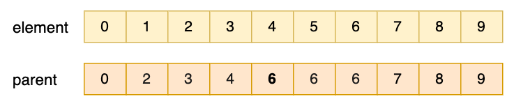

# 互斥集 Disjoint Sets

一堆集合，每個集合都是互斥的，即集合內的元素兩兩不相交，這樣的集合就是互斥集。

現實中，我們經常遇到這一類的問題：查詢某個元素是否屬於某個集合，或者某個元素和另一個元素是否屬於同一個集合。這類問題的最佳解決方案就是使用互斥集。

在互斥集的情況下，通常只使用合併和尋找兩種操作，因此中文俗稱併查集，源自於它支援兩種操作：「合併（Merge）、聯集（Union）」和查詢（Find）。在英文中又被稱為聯合-尋找資料結構（Union-Find data structure）或者合併-尋找集合（Merge-Find Set）。

一般以樹形結構儲存，多棵樹構成一個森林，每棵樹構成一個集合，樹中每個節點就是該集合的元素。

## 沒有優化的 Union-Find

find 就是查詢兩個元素是否屬於同一個集合。union 就是將兩個小集合合併成一個大集合。在實踐中，union 也是透過指定兩個元素、合併這兩元素所在的集合來實現的。

我們先用一個陣列來代表集合，雖然現在 JavaScript 也有 `Set` 這種資料結構，但建議使用最通用的陣列。假設有 10 個元素 0 ~ 9，每個元素都有自己的小組，自己是自己的小組長。0 屬於第 0 個小組（集合）、1 屬於第 1 個小組（集合）、2 屬於第 2 個小組（集合）……如下所示：

<div align="center">
  
  <p>尚未做合併操作的陣列</p>
</div>

現在我們要做合併操作，假設要讓 5 和 6 合併，都歸在第 6 組；1 和 2 合併，都歸在第 2 組，如下所示：

<div align="center">
  
  <p>5 與 6、1 與 2 合併的陣列</p>
</div>

這樣的合併操作，用程式碼實作起來也簡單，`arr[1] = arr[2], arr[5] = arr[6]`。

如果要第二組和第三組合併呢？ `arr[1] = arr[2] = arr[3]`，這樣一來，1、2、3 都歸在第 3 組，如下圖：

<div align="center">
  
  <p>第二組和第三組合併後的陣列</p>
</div>

然後第 3 組與第 4 組合併，`arr[1] = arr[2] = arr[3] = arr[4]`，如下圖：

<div align="center">
  
  <p>第三組和第四組合併後的陣列</p>
</div>

接著第 4 組和第 5 組進行組隊，1 帶著原先所有的小組員一起加入 5 所在的小組。5 在哪個小組呢？ 因為 `arr[5] === 6`，所以 5 在第 6 組，1 帶著所有組員進入第 6 組，如下圖：

<div align="center">
  
  <p>第四組和第五組合併後的陣列</p> 
</div>

最後我們用程式碼實際描述一下：

```js
class UnionFind {
  constructor(size) {
    this.size = size; // 表示目前還有多少個小組
    this.parents = new Array(size);
    for (let i = 0; i < size; i++) {
      this.parents[i] = i;
    }
  }

  // 查看元素屬於哪個集合
  query(element) {
    return this.parents[element];
  }

  // 合併 a, b 兩個元素所在的集合
  merge(a, b) {
    const aParent = this.query(a);
    const bParent = this.query(b);
    // 如果這兩個元素不是同一個集合，則合併
    if (aParent !== bParent) {
      this.size--;
      // 遍歷陣列，使原來的 aParent、bParent 都變成 bParent
      for (let i = 0; i < this.size; i++) {
        if (this.parents[i] === aParent) {
          this.parents[i] = bParent;
        }
      }
    }
  }

  // 查看元素 a, b 是否屬於同一個集合，如果不在同一個集合，則合併（連接）
  isConnected(a, b) {
    return this.query(a) === this.query(b);
  }

  toString() {
    return this.parents.join(' ');
  }
}

const uf = new UnionFind(10);
console.log('初始化');
console.log(uf.toString());

console.log('連接 5, 6');
uf.merge(5, 6);
console.log(uf.toString());

console.log('連接 1, 2');
uf.merge(1, 2);
console.log(uf.toString());

console.log('連接 2, 3');
uf.merge(2, 3);
console.log(uf.toString());

console.log('連接 1, 4');
uf.merge(1, 4);
console.log(uf.toString());

console.log('連接 1, 5');
uf.merge(1, 5);
console.log(uf.toString());

console.log('1 6 是否連接：' + uf.isConnected(1, 6));
console.log('1 8 是否連接：' + uf.isConnected(1, 8));
```

執行上面程式碼，結果如下：

```
初始化
0 1 2 3 4 5 6 7 8 9
連接 5, 6
0 1 2 3 4 6 6 7 8 9
連接 1, 2
0 2 2 3 4 6 6 7 8 9
連接 2, 3
0 3 3 3 4 6 6 7 8 9
連接 1, 4
0 4 4 4 4 6 6 7 8 9
連接 1, 5
0 6 6 6 6 6 6 7 8 9
1 6 是否連接：true
1 8 是否連接：false
```

## 快速合併，慢查詢

在上面的 union-find 裡，陣列保存著元素對應的編號。當我們合併時，需要對某一個組的所有元素進行重置，這樣的合併操作效能比較差，合併一次的時間複雜度是 $O(n)$。

這時我們可以只改一個，不要全部都改。為了實現這一點，我們就要在最開始的合併時，決定某一個是新小組的組長，讓每個元素有從屬關係，在資料結構中，從屬關係通常表示為父子節點。如果一個父節點下面有多個子節點，就是一棵樹了。但這邊我們不改太多，依然使用陣列表示。

一開始還是跟上面一樣，每個元素都是一個小組，自己是自己的組長。

當 5 和 6 合併、1 和 2 合併時，看似與原來的合併沒有什麼不同。但是當 2 和 3 合併時，2 組的組長是 2，那我們只需將 2 改成 3，如下圖：

<div align="center">
  
  <p>2 和 3 合併後的陣列</p>
</div>

然後 3 和 4 合併，3 組的組長是 3，那我們只需將 3 改成 4，如下圖：

<div align="center">
  
  <p>3 和 4 合併後的陣列</p>
</div>

最後 4 和 5 合併，其實 5 組已經不存在，所以變成 4 和 6 合併，直接將 4 組組長的值改成 6，如下圖：

<div align="center">
  
  <p>4 和 6 合併後的陣列</p>
</div>

橫排觀察不是很直覺，我們將一部分有從屬關係的改成縱向，如下圖：

<div align="center">
  
</div>

現在重新用程式碼來呈現：

```js
class UnionFind {
  constructor(size) {
    this.size = size; // 表示目前還有多少個小組
    this.parents = new Array(size);
    for (let i = 0; i < size; i++) {
      this.parents[i] = i;
    }
  }

  // 查看元素屬於哪個集合
  query(element) { // 只回傳組長
    const p = this.parents;
    while (element !== p[element]) { // 一樣，說明找到頂，否則繼續往上找
      element = p[element];
    }
    return element;
  }

  // 合併 a, b 兩個元素所在的集合
  merge(a, b) {
    const aParent = this.query(a);
    const bParent = this.query(b);
    // 如果這兩個元素不是同一個集合，將其中一個集合的“組長”的值改寫成另一個集合的“組長”的值
    if (aParent !== bParent) {
      this.size--;
      this.parents[aParent] = bParent;
    }
  }

  isConnected(a, b) {/* 略 */}

  toString() {/* 略 */}
}

const uf = new UnionFind(10);
console.log('初始化');
console.log(uf.toString());

console.log('連接 5, 6');
uf.merge(5, 6);
console.log(uf.toString());

console.log('連接 1, 2');
uf.merge(1, 2);
console.log(uf.toString());

console.log('連接 2, 3');
uf.merge(2, 3);
console.log(uf.toString());

console.log('連接 1, 4');
uf.merge(1, 4);
console.log(uf.toString());

console.log('連接 1, 5');
uf.merge(1, 5);
console.log(uf.toString());

console.log('1 6 是否連接：' + uf.isConnected(1, 6));
console.log('1 8 是否連接：' + uf.isConnected(1, 8));
```

執行上面程式碼，結果如下：

```
初始化
0 1 2 3 4 5 6 7 8 9
連接 5, 6
0 1 2 3 4 6 6 7 8 9
連接 1, 2
0 2 2 3 4 6 6 7 8 9
連接 2, 3
0 2 3 3 4 6 6 7 8 9
連接 1, 4
0 2 3 4 4 6 6 7 8 9
連接 1, 5
0 2 3 4 6 6 6 7 8 9
1 6 是否連接：true
1 8 是否連接：false
```

## 基於權重的快速合併，快速查詢

現在合併的效能提升了，開始考慮改進查詢速度。仔細觀察後發現，查詢速度取決於合併時產生的父節點的數量。也就是說，樹越深，查詢速度越慢。而我們在建樹時，只是盲目地選擇往某一個方向添加，例如 2 組與 3 組合併，我們總是選擇後者成為新組的“組長”，這樣會導致成樹越來越長，最壞的情況會變成一條鏈。

為了避免這種情況發生，我們需要調整建樹的方式，其中一個較常用的有基於權重進行拼接和基於深度進行拼接。這裡我們先看第一種。

比如：有下面兩個集合（如圖），其中 2 和 6 是兩個集合的根。現在對它們進行合併，那麼新的組長會是誰？一般來說，就是誰的“組員”多，誰就是新的組長。這就是基於權重的合併邏輯，權重就是指集合中元素的個數。

<div align="center">
  
  <p>權重不同的兩個集合</p>
</div>

元素 2 有 4 個組員，再加上自己一共 5 人，而元素 6 有 2 個組員，再加上自己一共 3 人。很顯然元素 2 的人多，所以 2 來當合併後的根。

實際程式碼如下：

```js
class UnionFind {
  constructor(size) {
    this.size = size; // 表示目前還有多少個小組
    this.parents = new Array(size);
    this.weights = new Array(size);
    for (let i = 0; i < size; i++) {
      this.parents[i] = i;
      this.weights[i] = 1; // 每個集合只有一個元素
    }
  }

  // 查看元素屬於哪個集合
  query(element) {
    const p = this.parents;
    while (element !== p[element]) {
      element = p[element];
    }
    return element;
  }

  // 合併 a, b 兩個元素所在的集合
  merge(a, b) {
    const aParent = this.query(a);
    const bParent = this.query(b);

    if (aParent !== bParent) {
      this.size--;
      if (this.weights[aParent] > this.weights[bParent]) {
        this.parents[bParent] = aParent;
        this.weights[aParent] += this.weights[bParent];
      } else {
        this.parents[aParent] = bParent;
        this.weights[bParent] += this.weights[aParent];
      }
    }
  }

  isConnected(a, b) {/* 略 */}

  toString() {/* 略 */}
}

const uf = new UnionFind(10);
console.log('初始化');
console.log(uf.toString());

console.log('連接 5, 6');
uf.merge(5, 6);
console.log(uf.toString());

console.log('連接 1, 2');
uf.merge(1, 2);
console.log(uf.toString());

console.log('連接 2, 3');
uf.merge(2, 3);
console.log(uf.toString());

console.log('連接 1, 4');
uf.merge(1, 4);
console.log(uf.toString());

console.log('連接 1, 5');
uf.merge(1, 5);
console.log(uf.toString());

console.log('1 6 是否連接：' + uf.isConnected(1, 6));
console.log('1 8 是否連接：' + uf.isConnected(1, 8));
```

執行上面程式碼，結果如下：

```
初始化
0 1 2 3 4 5 6 7 8 9
連接 5, 6
0 1 2 3 4 6 6 7 8 9
連接 1, 2
0 2 2 3 4 6 6 7 8 9
連接 2, 3
0 2 2 2 4 6 6 7 8 9
連接 1, 4
0 2 2 2 2 6 6 7 8 9
連接 1, 5
0 2 2 2 2 6 2 7 8 9
1 6 是否連接：true
1 8 是否連接：false
```

## 基於深度的快速合併，快速查詢

上面介紹的是，當兩個集合合併時，誰權重大，就是誰來當合併後的根。效率相對之前有了提升，但還是有深度太深的問題，Union-Find 越深，就越接近線性查詢，`query` 的時間複雜度會趨近於 $O(n)$。於是有了基於深度的合併，合併時，誰的深度深，誰就是新的根。這樣集合的深度最多為夠深的集合的深度，而不會讓深度增加。

例如上面的例子中，元素 2 的深度是 2，元素 6 的深度是 3，基於權重合併後，新集合的深度是 4。如果基於深度，新的集合的深度就是 3，如下圖：

<div align="center">
  
  <p>基於權重和深度的兩種合併</p>
</div>

如果兩組深度一樣呢？那就隨便選一個當根就好了，然後為新組的深度加 1。

程式碼實作如下：

```js
class UnionFind {
  constructor(size) {
    this.size = size; // 表示目前還有多少個小組
    this.parents = new Array(size);
    this.depth = new Array(size);
    for (let i = 0; i < size; i++) {
      this.parents[i] = i;
      this.depth[i] = 1; // 每個集合只有一個元素
    }
  }

  // 查看元素屬於哪個集合
  query(element) {
    const p = this.parents;
    while (element !== p[element]) {
      element = p[element];
    }
    return element;
  }

  // 合併 a, b 兩個元素所在的集合
  merge(a, b) {
    const aParent = this.query(a);
    const bParent = this.query(b);

    if (aParent !== bParent) {
      this.size--;
      if (this.depth[aParent] > this.depth[bParent]) {
        this.parents[bParent] = aParent;
      } else if (this.depth[aParent] < this.depth[bParent]) {
        this.parents[aParent] = bParent;
      } else {
        this.parents[aParent] = bParent;
        this.depth[bParent]++;
      }
    }
  }

  isConnected(a, b) {/* 略 */}

  toString() {/* 略 */}
}
```

## 基於權重與路徑壓縮的快速合併，快速查詢

路徑壓縮就是處理併查集中過深的節點。實作方式很簡單，就是在 `query` 方法裡加上一行 `parents[element] = parents[parents[element]]`，這行的用意是，讓目前節點指向自己父親的父親，減少深度，同時也沒有改變根節點的權重（非根節點的權重改變了也無所謂）。具體過程如下圖：

<div align="center">
  
  <p>路徑壓縮過程</p>
</div>

注意：只能在基於權重的併查集上改 `query` 方法，而不能在基於深度的併查集上採用此種改進方式。因為路徑壓縮後，根的深度會改變，而深度改變後又不方便重新計算。

程式碼實作如下：

```js
class UnionFind {
  constructor(size) {
    this.size = size; // 表示目前還有多少個小組
    this.parents = new Array(size);
    this.weights = new Array(size);
    for (let i = 0; i < size; i++) {
      this.parents[i] = i;
      this.weights[i] = 1; // 每個集合只有一個元素
    }
  }

  // 查看元素屬於哪個集合
  query(element) {
    const p = this.parents;
    while (element !== p[element]) {
      p[element] = p[p[element]];
      element = p[element];
    }
    return element;
  }

  // 合併 a, b 兩個元素所在的集合
  merge(a, b) {
    const aParent = this.query(a);
    const bParent = this.query(b);

    if (aParent !== bParent) {
      this.size--;
      if (this.weights[aParent] > this.weights[bParent]) {
        this.parents[bParent] = aParent;
        this.weights[aParent] += this.weights[bParent];
      } else {
        this.parents[aParent] = bParent;
        this.weights[bParent] += this.weights[aParent];
      }
    }
  }

  isConnected(a, b) {/* 略 */}

  toString() {/* 略 */}
}

const uf = new UnionFind(10);
console.log('初始化');
console.log(uf.toString());

console.log('連接 5, 6');
uf.merge(5, 6);
console.log(uf.toString());
console.log('連接 5, 6 之後的 weights: ');
console.log(uf.weights);

console.log('連接 1, 2');
uf.merge(1, 2);
console.log(uf.toString());
console.log('連接 1, 2 之後的 weights: ');
console.log(uf.weights);

console.log('連接 2, 3');
uf.merge(2, 3);
console.log(uf.toString());
console.log('連接 2, 3 之後的 weights: ');
console.log(uf.weights);

console.log('連接 1, 4');
uf.merge(1, 4);
console.log(uf.toString());
console.log('連接 1, 4 之後的 weights: ');
console.log(uf.weights);

console.log('連接 1, 5');
uf.merge(1, 5);
console.log(uf.toString());
console.log('連接 1, 5 之後的 weights: ');
console.log(uf.weights);

console.log('1 6 是否連接：' + uf.isConnected(1, 6));
console.log('1 8 是否連接：' + uf.isConnected(1, 8));
```

## 相關問題

基於 union-find 的合併查詢特性，可以加快 547.Number of Provinces、200.Number of Islands、721. Accounts Merge 等問題的解決速度。

### Number of Provinces

這題是 LeetCode 的 [547. Number of Provinces](https://leetcode.com/problems/number-of-provinces/)。題目描述如下：

有 `n` 座城市。其中有些是連通的，而有些則沒有。如果城市 `a` 與城市 `b` 有直接連通，而且城市 `b` 與城市 `c` 也有直接連通，則城市 `a` 與城市 `c` 將間接地連通。

一個省為一群直接或間接地連通之城市而且沒有其他不屬於該群體的城市存在。

給你一個 `n x n` 的矩陣 `isConnected` ，其中 `isConnected[i][j] = 1` 表示第 `i` 個城市和第 `j` 個城市直接相連，而 `isConnected[i][j] = 0` 表示二者不直接相連。

題目需求是回傳矩陣中有多少個省。

Example 1：


```txt
Input: isConnected = [[1,1,0],[1,1,0],[0,0,1]]
Output: 2
```

Example 2：


```txt
Input: isConnected = [[1,0,0],[0,1,0],[0,0,1]]
Output: 3
```

這是一道典型的 union-find 問題，我們只需將矩陣中的元素進行合併，最後統計有多少個根節點即可。

```js
function findCircleNum(isConnected) {
  const n = isConnected.length;
  const union = new UnionFind(n);

  for (let i = 0; i < n; i++) {
    const row = isConnected[i];
    for (let j = 0; j < row.length; j++) {
      if (row[j] === 1) union.merge(i, j);
    }
  }

  return union.size;
}
```

### Number of Islands

這題是 LeetCode 的 [200. Number of Islands](https://leetcode.com/problems/number-of-islands/)。題目描述如下：

給你一個由 `'1'`（陸地）和 `'0'`（水）組成的 01 矩陣。請你計算矩陣中島嶼的數量。

島嶼總是被水包圍，並且每座島嶼只能由水平方向和/或垂直方向上相鄰的陸地連接形成。

此外，你可以假設該矩陣的四邊均被水包圍。

Example 1：

```txt
Input: grid = [
  ["1","1","1","1","0"],
  ["1","1","0","1","0"],
  ["1","1","0","0","0"],
  ["0","0","0","0","0"]
]
Output: 1
```

Example 2：

```txt
Input: grid = [
  ["1","1","0","0","0"],
  ["1","1","0","0","0"],
  ["0","0","1","0","0"],
  ["0","0","0","1","1"]
]
Output: 3
```

我們首先要確定初始狀態下有多少個小組。由於長寬不同，所以我們就直接將數字的數量作為小組數量，但裡面有許多無效的（`0` 不會參與合併），因此要將它過濾掉。接下來就是對矩陣進行遍歷，對於每個元素，如果它是陸地，就將它與上下左右的元素進行合併，最後統計有多少個小組即可。

實作程式碼如下：

```js
function numIslands(grid) {
  let size = 0;
  let total = 0;
  for (let i = 0; i < grid.length; i++) {
    const row = grid[i];
    for (let j = 0; j < row.length; j++) {
      if (row[j] === '1') {
        size++;
      }
      total++;
    }
  }

  const uf = new UnionFind(total);
  uf.size = size;

  for (let i = 0; i < grid.length; i++) {
    const row = grid[i];
    const topRow = grid[i - 1]; // 上面一列
    const n = row.length;
    for (let j = 0; j < n; j++) {
      if (row[j] === '1' && row[j + 1] === '1') {
        uf.merge(i * n + j, i * n + j + 1); // 左右相鄰，合併
      }
      if (topRow && row[j] === '1' && topRow[j] === '1') {
        uf.merge(i * n + j, (i - 1) * n + j); // 上下相鄰，合併
      }
    }
  }

  return uf.size;
}
```

### Accounts Merge

這題是 LeetCode 的 [721. Accounts Merge](https://leetcode.com/problems/accounts-merge/)。題目描述如下：

給定一個列表 `accounts`，每個元素 `accounts[i]` 都是一個字串列表，其中第一個元素 `accounts[i][0]` 是 `name[i]`，其餘元素是 `emails[i]` 表示該帳戶的 email 地址。

現在我們要合併這些帳戶。如果兩個帳戶都有一個共同的 email 地址，則這兩個帳戶必定屬於同一個人。請注意，即使兩個帳戶具有相同的名稱，它們也可能屬於不同的人，因為人們可能會重名。一個人最初可以有任意多個帳戶，但其所有帳戶都具有相同的名稱。

帳戶合併後，按以下格式回傳帳戶：每個帳戶的第一個元素是名稱，其餘元素是按順序排列的電子郵件。帳戶（accounts）本身可以按任意順序回傳。

Example 1：

```txt
Input: accounts = [
  ["John","johnsmith@mail.com","john_newyork@mail.com"],
  ["John","johnsmith@mail.com","john00@mail.com"],
  ["Mary","mary@mail.com"],
  ["John","johnnybravo@mail.com"]
]
Output: [
  ["John","john00@mail.com","john_newyork@mail.com","johnsmith@mail.com"],
  ["Mary","mary@mail.com"],
  ["John","johnnybravo@mail.com"]
]
Explanation:
第一個和第二個 John 是同一個人，因為他們有共同的 email "johnsmith@mail.com"，
第三個 John 和 Mary 是不同的人，因為他們的 email 沒有被其他帳戶使用。
我們可以以任何順序回傳這些列表，例如答案 [['Mary', 'mary@mail.com'], ['John', 'johnnybravo@mail.com'], 
['John', 'john00@mail.com', 'john_newyork@mail.com', 'johnsmith@mail.com']] 也是可接受的。
```

這題的難點是高效判定 email 是否屬於某個人。但是名字可能重複，所以我們用索引值，這個索引值在 union-find 中就是小組編號。我們將每個 email 與索引值進行映射，然後對每個帳戶進行遍歷，將每個 email 與第一個 email 進行合併，最後統計有多少個小組，然後將每個小組的 email 進行合併，最後將結果整理成題目要求的格式即可。

實作程式碼如下：

```js
function accountsMerge(accounts) {
  const uf = new UnionFind(accounts.length);
  const owners = {};

  // 開始合併帳戶
  for (let i = 0; i < accounts.length; i++) {
    const emails = accounts[i];
    for (let j = 1; j < emails.length; j++) {
      const email = emails[j];
      if (Object.hasOwn(owners, email)) {
        const owner = owners[email];
        uf.merge(owner, i); // 如果共用同一個 email，就合併帳戶
      } else {
        owners[email] = i;
      }
    }
  }

  // 將同一個帳戶的 email 放在一起
  const userEmails = {};
  for (let i = 0; i < accounts.length; i++) {
    const root = uf.query(i); // 找到合併後小組的索引值名
    const emails = accounts[i];
    if (!userEmails[root]) {
      userEmails[root] = new Set();
    }
    emails.forEach((email, i) => {
      if (i > 0) {
        userEmails[root].add(email);
      }
    });
  }

  const result = [];
  for (const [root, emails] of Object.entries(userEmails)) {
    const name = accounts[root][0];
    const sortedEmails = [...emails].sort();
    result.push([name, ...sortedEmails]);
  }

  return result;
}
```
